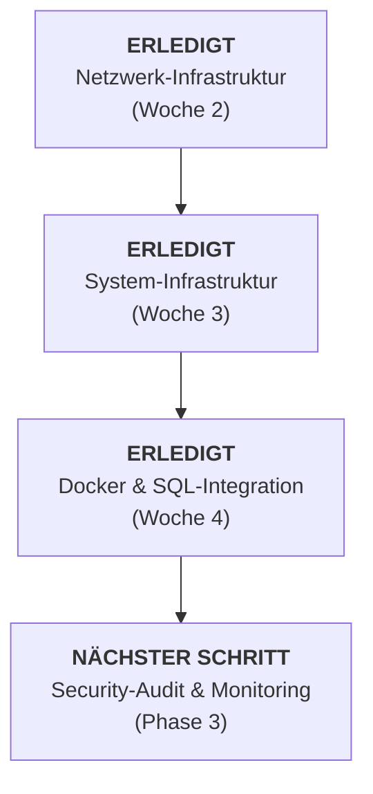

# 📅 Projekt-Meilensteine

### Meilenstein-Historie
- **16.02.2026:** Kick-off & Analyse ✅
- **20.02.2026:** Abschluss Planungsphase (TF1) ✅
- **27.02.2026:** Netzwerkkonnektivität stabil (VPN/DNS) ✅
- **06.03.2026:** Active Directory & Firewall-Härtung ✅
- **12.03.2026:** Docker-Services & LDAP-Mail-Integration ✅
