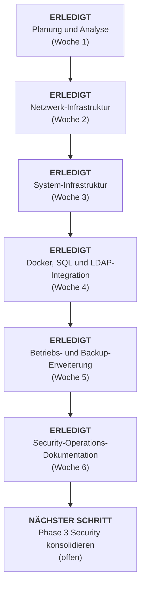

# 00 01 Masterdokumentation

# Master-Dokumentation: BetaTrade Modernisierung (Projekt-ID 13)

## Dashboard

**Projektstatus:** Phase 1 und Phase 2 abgeschlossen  
**Aktuelle Phase:** Uebergabevorbereitung / Vorbereitung von Phase 3 Security  
**Letzter dokumentierter Meilenstein:** Security-Scan, SIEM/IDS-Bausteine und Sicherheitsrichtlinie dokumentiert (27.03.2026)  
**Stand:** 27.03.2026

### Projektphasen

| Phase | Zeitraum | Status | Hauptziele | Verantwortlich |
|---|---|---|---|---|
| 1 | Woche 1 | Abgeschlossen | Kaiserslautern VLAN, DHCP-Relay, VoIP, Planungsunterlagen | Netzwerk-Team TF2 |
| 2 | Woche 2-4 | Abgeschlossen | Mainz VPN, AD, DHCP, DNS, Docker, SQL, LDAP | Netzwerk-Team TF2 |
| 3 | Woche 5+ | Vorbereitet / teilweise flankiert | Monitoring, IDS, Incident Response, ISO 27001 | Security-Team |

## Projektstatus

**Projektleitung:** AlphaTech GmbH  
**Projektstart:** 16.02.2026  
**Letzter dokumentierter Stand:** 27.03.2026  
**Status Planungsphase:** Abgeschlossen (20.02.2026)  
**Status Umsetzungsphase:** Abgeschlossen (12.03.2026)  
**Status Erweiterung Security Operations:** Dokumentiert bis Woche 6  
**Status Uebergabe:** Vorbereitet  
**Naechster Schwerpunkt:** Phase 3 Security / Konsolidierung der Security-Dokumentation

## Gesamtuebersicht

### Themenfelder und Arbeitsverlauf

#### Themenfeld 1: Planung und Konzeption

| Tag | Datum | Fokus | Status |
|---|---|---|---|
| Tag 1 | 16.02.2026 | Onboarding und Anforderungsanalyse | Abgeschlossen |
| Tag 2 | 17.02.2026 | Projektstruktur und Risikoanalyse | Abgeschlossen |
| Tag 3 | 18.02.2026 | Detailanalyse und Loesungswege | Abgeschlossen |
| Tag 4 | 19.02.2026 | Finalisierung und Uebergabevorbereitung | Abgeschlossen |
| Tag 5 | 20.02.2026 | Reflexion, QA und Abschluss Woche 1 | Abgeschlossen |

#### Themenfeld 2: Umsetzung Netzwerk und Systemadministration

| Woche | Fokus | Hauptaufgaben | Status |
|---|---|---|---|
| Woche 2 | Netzwerk-Infrastruktur | pfSense Routing, DHCP-Relay, DHCP, DNS, VPN | Abgeschlossen |
| Woche 3 | System-Infrastruktur | AD, GPOs, VPN-Haertung, Dokumentationsbereinigung | Abgeschlossen |
| Woche 4 | Applikations-Ebene | Docker, SQL, Mailcow LDAP, SSH/VPN Optimierung, Security-Vorbereitung | Abgeschlossen |

#### Erweiterung ab Woche 5

| Woche | Fokus | Hauptaufgaben | Status |
|---|---|---|---|
| Woche 5 | Betrieb und Backup | Freescout, Supportfall, Cloud-Backup, Restore-Test, Automatisierung | Abgeschlossen |
| Woche 6 | Security Operations | OpenVAS, ELK/Suricata, Angriffssimulation, Sicherheitsrichtlinie | Abgeschlossen |

### Phasen-Uebersicht

| Phase | Zeitraum | Status | Hauptziele |
|---|---|---|---|
| 1 | Woche 1 | Abgeschlossen | Kaiserslautern VLAN, DHCP-Relay, VoIP, HSRP-Zielbild |
| 2 | Woche 2-4 | Abgeschlossen | Mainz VPN, AD, DHCP, DNS, Docker, SQL, LDAP |
| 3 | Woche 5+ | Vorbereitet / teilweise flankiert | Monitoring, IDS, Incident Response, ISO 27001 |

## Chronik

**Visuelle Timeline:** `Markwhen/BetaTrade Projekt als Markwhen Timeline.mw`

| Datum | Ereignis / Meilenstein | Status | Verweis |
|---|---|---|---|
| 16.02.2026 | Projektstart, Onboarding und Kundenakte-Analyse | Abgeschlossen | 02_01_Tag_1_Onboarding_Analyse.md |
| 17.02.2026 | Gantt-Plan, Risikoanalyse und Scope-Definition | Abgeschlossen | 02_01_Tag_2_Projektstruktur_Risikoanalyse.md |
| 18.02.2026 | Detailanalyse Phase 1 und 2, Loesungswege | Abgeschlossen | 02_01_Tag_3_Detailanalyse_Loesungswege.md |
| 19.02.2026 | Uebergabevorbereitung und Packet-Tracer-Analyse | Abgeschlossen | 02_01_Tag_4_Finalisierung_Übergabe.md |
| 20.02.2026 | QA, Reflexion, Risiko- und KPI-Schaerfung | Abgeschlossen | 02_01_Tag_5_Puffer_Reflexion.md |
| 23.02.-27.02.2026 | Netzwerkumsetzung in Mainz und Labor 13 | Abgeschlossen | 02_02_Tag_1-3_Netzwerkimplementierung.md |
| 27.02.2026 | VPN-Infrastruktur und PKI aufgebaut | Abgeschlossen | 02_02_Tag_5_VPN_Infrastruktur.md |
| 02.03.-06.03.2026 | AD-Aufbau, GPOs und Firewall-Haertung | Abgeschlossen | 02_03_Tag_1-2_AD_Infrastruktur.md |
| 09.03.-12.03.2026 | Docker, SQL, Mailcow-Integration und VPN-/SSH-Optimierung | Abgeschlossen | 02_04_Tag_1_Docker_SQL_Infrastruktur.md |
| 12.03.2026 | Uebergabe vorbereitet, Security-Phase als naechster Schritt markiert | Abgeschlossen | 04_03_Uebergabe_Protokoll.md |
| 16.03.-23.03.2026 | Freescout, Backup, Restore-Test und Automatisierung dokumentiert | Abgeschlossen | 02_05_Tag_1_Freescout_Einrichten.md |
| 24.03.-27.03.2026 | Security Scan, ELK/Suricata, Angriffssimulation und Sicherheitsrichtlinie | Abgeschlossen | 02_06_Tag_1_Security_Scan_(OpenVAS_Greenbone).md |

## Meilensteine

### Meilenstein-Historie
- **16.02.2026:** Kick-off, Onboarding und Analyse abgeschlossen
- **20.02.2026:** Planungsphase und Dokumentationsgrundlage abgeschlossen
- **27.02.2026:** Netzwerkkonnektivitaet, DHCP, DNS und VPN stabil dokumentiert
- **06.03.2026:** Active Directory, Gruppenrichtlinien und Firewall-Haertung abgeschlossen
- **12.03.2026:** Docker-Services, SQL-Umgebung und Mailcow-LDAP-Anbindung abgeschlossen
- **23.03.2026:** Freescout-, Backup- und Restore-Strecke dokumentiert
- **27.03.2026:** Security-Scan, SIEM/IDS-Bausteine und Sicherheitsrichtlinie dokumentiert

## Zentrale Ressourcen

### Netzwerk und Konnektivitaet
- 03_01a_Netzplan_Kaiserslautern.md
- 03_01b_VLAN_IP_Matrix.md
- 05_02_Cisco_Config_TF2.md
- 02_03_Tag_5_VPN_Firewall_Härtung.md

### Systeme und Applikationen
- 02_03_Tag_1-2_AD_Infrastruktur.md
- 01_05_Guide_Docker_SQL.md
- 01_06_Guide_Mailcow_AD_Integration.md
- 02_04_Tag_4_Monitoring_Security_Vorbereitung.md

### Management und Abschluss
- 04_02_Risiko_Register.md
- 04_03_Uebergabe_Protokoll.md

