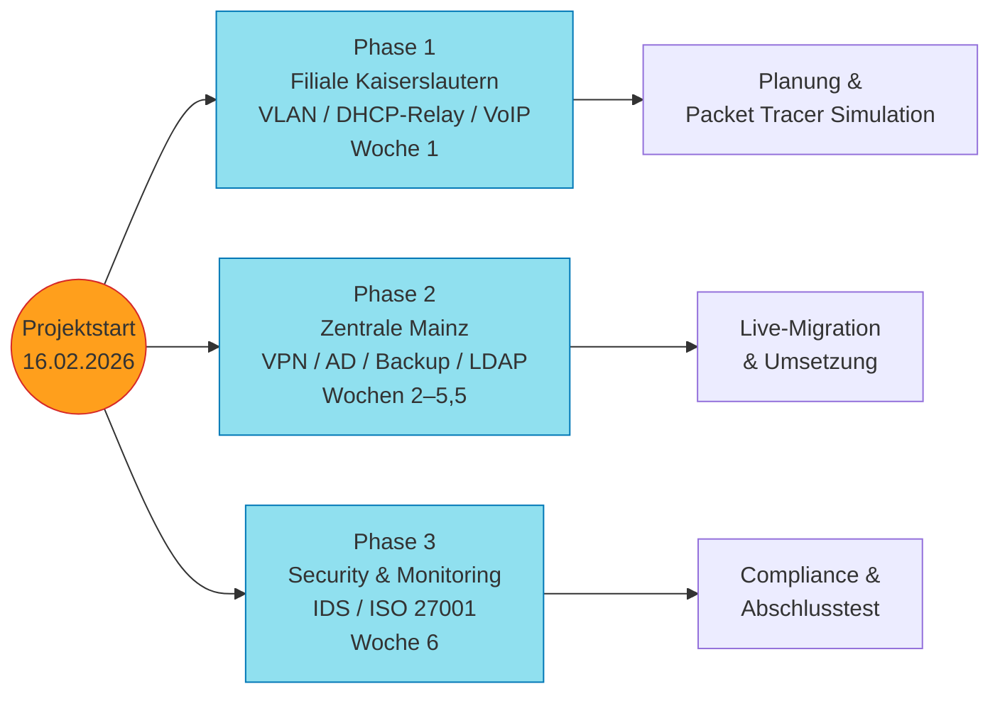

## Tag 1: Onboarding & Analyse

**Datum:** 16.02.2026  
**Bearbeiter:** Projektassistenz (AlphaTech GmbH)  
**Status:** ✅ Erledigt

### Tagesziele (PM-1)

- [x] Team-Kick-off und Projektverständnis entwickeln
- [x] Netzwerk-Szenarien verstehen (Kaiserslautern & Mainz)
- [x] Technische Arbeitsumgebung einrichten
- [x] Projektdokumentation strukturieren
- [x] Erste Anforderungsanalyse durchführen

### Gruppenarbeit

1. **Team-Kick-off**
   - MS Teams Meeting
   - Gemeinsames Lesen der digitalen Kundenakte
   - Klärung: Welche Aufgaben übernimmt AlphaTech in den drei Phasen?
   - Aufgabenteilung Dokumentation
   - Dokumentationstool: Obsidian (PDF-Export zwingend erforderlich)

2. **Netzwerk-Szenarien verstehen**
   - Packet Tracer Topologie Filiale Kaiserslautern analysiert (3 Abteilungen, hierarchisches Design)
   - Topologie Zentrale Mainz betrachtet (kleine Abteilung + Server)
   - Unterschiede: Kaiserslautern = neues Netz mit Segmentierung, Mainz = Modernisierung Live-Systeme

### Einzelarbeit

1. **Technische Arbeitsumgebung**
   - [x] Dashboard-Login und Erkundung
   - [x] Admin-VM gestartet
   - [x] VPN-Config installiert & Verbindung getestet
   - [x] RDP-Verbindung zur Admin-VM stabil
   - [x] Grundfunktionen überprüft (keine Probleme)

2. **Dokumentation strukturieren**
   - Projektordner "BetaTrade-Modernisierung" angelegt
   - Startseite mit Projektüberblick erstellt

3. **Erste Anforderungsanalyse**
   - Kritische Schwachstellen aus Kundenakte:
     - Keine VLAN-Segmentierung → Broadcast-Domänen vermischt
     - Externer Zugriff nur Passwort-gesichert → unsicher
     - Kein externes / zentrales Backup-Konzept
     - Fehlende abteilungsübergreifende VoIP-Telefonie

### Grobe Projektstruktur (Mermaid)

---
datum: 2026-02-16
tags:
  - #projektassistenz
  - #wissensmanagement
  - #onboarding
  - #obsidian
---

# Tag 1: Strukturierung & Tool-Entscheidung (Ergänzung)

> [!info] Fokus
> Aufbau einer nachhaltigen Dokumentationsstruktur und methodische Vorbereitung des Kundenprojekts BetaTrade AG.

## 1. Aufbau der Wissensdatenbank
- **Ordnerstruktur:** Die initiale Struktur im Obsidian-Vault wurde strikt getrennt nach: `Daily Notes`, `Ressourcen`, `Kundenakte BetaTrade` und `Netzwerk-Configs`.
- **Metadaten-Konzept:** Einführung von YAML-Frontmatter für alle Markdown-Dateien zur besseren Filterung (Standard-Tags: `Autor`, `Datum`, `Status`, `Priorität`).

## 2. Tool-Entscheidungsmatrix
> [!check] Entscheidung: Obsidian vs. Confluence/Notion
> Die Wahl fiel auf Obsidian. **Ausschlaggebende Argumente:** Volle Offline-Verfügbarkeit, lokale Datenhaltung (erfüllt strenge Datenschutzvorgaben) und zukunftssichere, exportierbare Markdown-Dateien.

## 3. Kick-off-Protokoll (Meeting Minutes)
- Strukturierte Erfassung des Initial-Meetings.
- **Kernziele:** Nahtlose Modernisierung ohne lange Downtimes.
- **Pain Points der BetaTrade AG:** Bisher ungeordnete Netzwerkstruktur und fehlende IT-Security in der Zentrale Mainz.