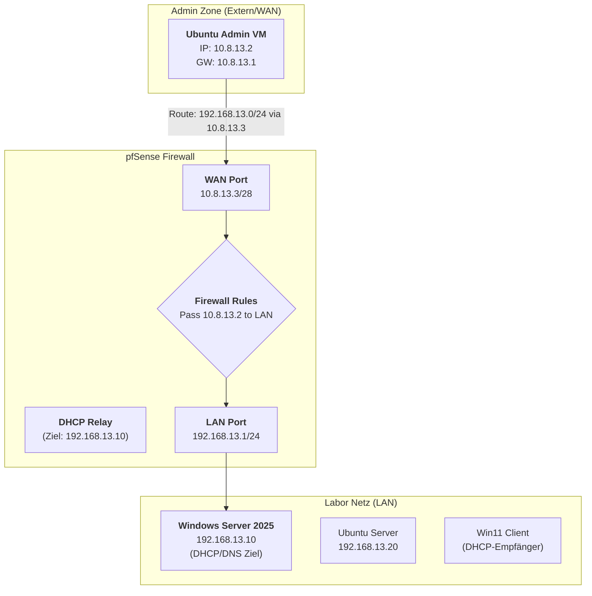

# 📝 Labor-Doku: Netzwerk-Konnektivität & DHCP-Vorbereitung

**Datum:** 2026-02-26 **Labor-ID:** 13 **Tags:** #Networking #pfSense #Ubuntu #Routing #DHCP-Migration

---

## 🗺️ Planfigur (Netzwerk-Architektur)

Die folgende Darstellung visualisiert den aktuellen Stand der Infrastruktur basierend auf der analysierten `config.xml`.



---

## 🛠️ Troubleshooting-Log (Versuchshistorie)

> [!FAILURE] Versuch 1: Falsches Gateway **Kommando:** `sudo ip route add 192.168.13.0/24 via 10.8.13.0` **Ergebnis:** `RTNETLINK answers: File exists` **Fehler:** Es wurde versucht, die Netz-ID (.0) als Gateway zu nutzen. Zudem blockierten Reste alter Routen den Befehl.

> [!WARNING] Versuch 2: Zu spezifische Route (Host-Route) **Kommando:** `sudo ip route add 192.168.13.1 via 10.8.13.3` **Ergebnis:** Zugriff auf pfSense-WebGUI möglich, aber LAN-Server (.10, .20) nicht erreichbar. **Erkenntnis:** Eine Host-Route (`/32`) reicht nicht aus; das gesamte Subnetz muss geroutet werden.

> [!SUCCESS] Lösung: Korrekte Netzwerk-Route **Kommando:** > 1. `sudo ip route del 192.168.13.1` (Bereinigung) 2. `sudo ip route add 192.168.13.0/24 via 10.8.13.3` **Ergebnis:** Volle Erreichbarkeit des internen Netzes sichergestellt.

---

## ⚙️ Wichtige Konfigurations-Parameter (XML-Check)

|Parameter|Wert|Bedeutung|
|---|---|---|
|**pfSense WAN IP**|`10.8.13.3`|Das Ziel-Gateway für die Admin-VM.|
|**pfSense LAN IP**|`192.168.13.1`|Das interne Gateway für alle Labor-Server.|
|**Firewall Rule**|`Pass 10.8.13.2`|Erlaubt der Admin-VM den Transit durch die Firewall.|
|**RFC1918 Filter**|`Disabled`|WAN-Blockade für private Netze wurde aufgehoben.|


---

## 🚀 Nächste Schritte: DHCP-Migration (Tag 4-6)

### 1. pfSense Vorbereiten

- [ ] **DHCP Server deaktivieren:** `Services > DHCP Server > LAN` -> Uncheck "Enable".
    
- [ ] **DHCP Relay aktivieren:** `Services > DHCP Relay` -> Interface: `LAN`, Destination: `192.168.13.10`.
    

### 2. Windows Server 2025 konfigurieren

- [ ] **Rolle installieren:** `DHCP Server`.
    
- [ ] **Scope erstellen:**
    
    - Name: `Labor_13_Scope`
        
    - Range: `192.168.13.100` - `192.168.13.130`
        
    - Gateway (Option 003): `192.168.13.1`
        
    - DNS (Option 006): `192.168.13.10`


```d2
direction: right

# Styling Definitionen
classes: {
  zone: {
    style: {
      stroke-width: 2
      border-radius: 10
    }
  }
  active_srv: {
    style: {
      fill: "#e8f5e9"
      stroke: "#2e7d32"
      stroke-width: 3
    }
  }
}

"Management Zone (WAN)": {
  class: zone
  style: { fill: "#e1f5fe"; stroke: "#01579b" }
  
  "Admin VM": {
    label: "💻 Ubuntu Admin VM\n10.8.13.2"
    shape: rectangle
  }
}

"pfSense Firewall": {
  class: zone
  style: { fill: "#fff3e0"; stroke: "#ef6c00" }
  
  WAN: "10.8.13.3\n(Gateway für Admin)"
  LAN: "192.168.13.1\n(Gateway für LAN)"
  
  WAN -> LAN: "Filter: RFC1918 Off\nRule: Pass 10.8.13.2" {
    style: { stroke-dash: 3 }
  }
}

"Labor Netzwerk (LAN)": {
  class: zone
  style: { fill: "#f5f5f5"; stroke: "#757575" }

  "Windows Server": {
    class: active_srv
    label: "🗄️ Windows Server 2025\n192.168.13.10\n(DHCP & DNS Ziel)"
    shape: cylinder
  }

  "Ubuntu Server": {
    label: "🗄️ Ubuntu Server\n192.168.13.20"
    shape: cylinder
  }

  "Windows Client": {
    label: "💻 Win 11 Client\nDHCP Client"
    shape: rectangle
  }
}

# Verbindungen
"Management Zone"."Admin VM" -> "pfSense Firewall".WAN: "Route: 192.168.13.0/24\nvia 10.8.13.3"

# DHCP Relay Logik
"Labor Netzwerk"."Windows Client" -> "pfSense Firewall".LAN: "1. DHCP Discover"
"pfSense Firewall".LAN -> "Labor Netzwerk"."Windows Server": "2. DHCP Relay Forward"

"pfSense Firewall".WAN -> Internet: "Next Hop: 10.8.13.1"
Internet: { 
  label: "☁️ Internet"
  shape: cloud 
}
```

---
datum: 2026-02-24
tags:
  - #umsetzung
  - #pfsense
  - #firewall
  - #security
---

# Tag 7: pfSense Firewall-Routing & Zugriffs-Management

> [!info] Tagesziel
> Inbetriebnahme der pfSense-Firewall als zentrales Gateway und Konfiguration des sicheren Admin-Zugriffs.

## 1. WAN-Port Blockade (HTTPS)
- **Problem:** Die pfSense konnte zwar von der Admin-VM (`10.8.13.2`) angepingt werden, aber die Web-GUI unter `https://10.8.13.1` war im Browser nicht erreichbar.
- **Ursache:** Die Firewall blockiert standardmäßig HTTP/HTTPS-Zugriffe auf der WAN-Schnittstelle, besonders aus sogenannten "privaten Netzwerken" (Bogon/Private Networks Block).

## 2. Der "Trojanische Pferd"-Workaround
> [!success] Lösungsansatz
> Um die initiale Blockade zu umgehen, wurde eine interne Windows-Client-VM genutzt, die sich bereits im zugelassenen LAN hinter der Firewall befand. Von dort aus konnte die Web-GUI aufgerufen und die WAN-Regeln für das Admin-Netzwerk angepasst werden.

## 3. Diagnose via SSH & tcpdump
- **Einsatz:** Bei weiterhin blockierten Verbindungen wurde die direkte pfSense-Shell genutzt (Login: `root` / `templateRootPassword`).
- **Befehl:** `tcpdump -i [interface] port 22` (Option 8 in der Console).
- **Erkenntnis:** Ließen sich die ankommenden Pakete auf der Firewall sehen, aber es kam keine Antwort, konnte das Problem auf das Zielsystem (z. B. den Windows Server) eingegrenzt werden.