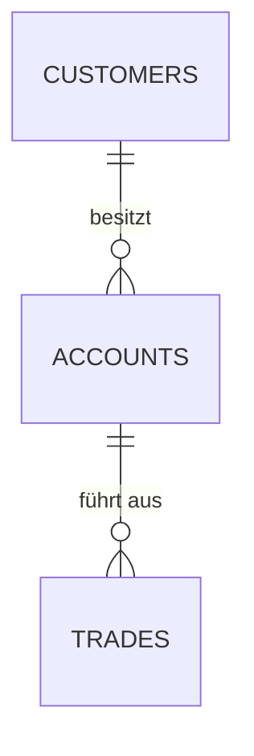

 
# 🛠️ Technischer Guide: Docker-Management & SQL-Analyse

**Ziel:** Aufbau einer containerisierten MySQL-Umgebung für BetaTrade und Durchführung von Datenanalysen zur Vorbereitung der Systemmigration.

## 1. Voraussetzungen
- Ubuntu Server VM mit Docker & Docker-Compose.
- Projektverzeichnis `/home/studentxx/betatrade-database/`.
- Credentials: `admin` / `betatrade`.

## 2. Durchführung: Docker Setup

### 2.1 Container-Handling
Grundlegende Befehle zur Steuerung der Umgebung:
- **Start:** `docker-compose up -d`
- **Logs prüfen:** `docker-compose logs -f`
- **Bereinigung:** `docker rm -f $(docker ps -aq)` (Entfernen aller Test-Container).

### 2.2 Datenbank-Verbindung
Der Zugriff erfolgt direkt über das Terminal oder den MySQL-Client:
```bash
mysql -uadmin -pbetatrade -h 127.0.0.1
```

## 3. SQL-Analysen (Business Intelligence)

### 3.1 Struktur
Die Datenbank `betatrade_db` umfasst die Tabellen `customers`, `accounts` und `trades`.

### 3.2 Key Queries
Hier sind die wichtigsten Abfragen für die Bestandsanalyse:

**Neukunden-Analyse (ab 2024):**
```sql
SELECT first_name, last_name, registration_date 
FROM customers 
WHERE registration_date >= '2024-01-01' 
ORDER BY registration_date ASC;
```

**Top-Trader Identifikation (März 2024):**
```sql
SELECT c.first_name, c.last_name, COUNT(t.trade_id) as trade_count
FROM customers c
JOIN accounts a ON c.customer_id = a.customer_id
JOIN trades t ON a.account_id = t.account_id
WHERE t.trade_date BETWEEN '2024-03-01' AND '2024-03-31'
GROUP BY c.customer_id
ORDER BY trade_count DESC
LIMIT 1;
```

## 4. Validierung & Backup
- **Backup erstellen:** `docker exec betatrade-mysql mysqldump -uadmin -pbetatrade betatrade_db > backup_tag3.sql`
- **Integritätsprüfung:** Test-Restore in eine separate Instanz durchgeführt.

## 5. Visualisierung

