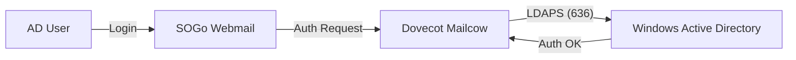

# 🛠️ Technischer Guide: Mailcow AD/LDAP Integration

**Ziel:** Anbindung des Mailcow-Mailservers an das Windows Active Directory zur zentralen Benutzerauthentifizierung.

## 1. Voraussetzungen
- Laufende Mailcow-Instanz auf Ubuntu-Server (`/opt/mailcow-dockerized/`).
- Windows Server 2025 mit konfiguriertem AD DS.
- DNS-Eintrag für `mail.betatrade.beta` zeigt auf die Linux-IP.

## 2. Durchführung: Mailcow Vorbereitung

### 2.1 DNS-Anpassung (Unbound)
Damit der Mailserver das AD finden kann, muss der interne DNS-Resolver (Unbound) angepasst werden.

Datei: `/opt/mailcow-dockerized/data/conf/unbound/unbound.conf`
```conf
local-zone: "net13.beta." transparent
domain-insecure: "net13.beta"

stub-zone:
  name: "net13.beta"
  stub-addr: 192.168.13.10  # IP des Windows Domain Controllers
```
*Nach der Änderung:* `docker compose restart unbound-mailcow`

### 2.2 AD-Seitige Vorbereitung
1. Erstellung eines **LDAP-Bind-Users** (z. B. `svc_mailcow`) im Active Directory.
2. Sammeln der Parameter:
   - **Base DN:** `DC=net13,DC=beta`
   - **Bind DN:** `CN=LDAP Service,OU=Service Account,DC=net13,DC=beta`

## 3. LDAP-Konfiguration in Mailcow
Die Konfiguration erfolgt über das Admin-Panel (`mail.betatrade.beta/admin`).

| Feld               | Wert (Beispiel)                                |
| :----------------- | :--------------------------------------------- |
| **Hostname**       | `192.168.13.10`                                |
| **Port**           | `636` (LDAPS)                                  |
| **Base DN**        | `DC=net13,DC=beta`                             |
| **Username Field** | `sAMAccountName`                               |
| **Filter**         | `(&(objectClass=user)(objectCategory=person))` |


## 4. Validierung & Test
1. **Verbindungstest:** Schaltfläche "Test Connection" in Mailcow nutzen.
2. **Login-Test:** Anmeldung am SOGo Webinterface (`mail.betatrade.beta/sogo`) mit einem AD-User.
3. **Log-Prüfung:** `docker compose logs --tail=100 dovecot-mailcow` bei Login-Problemen.


## 5. Visualisierung

samaccountname
