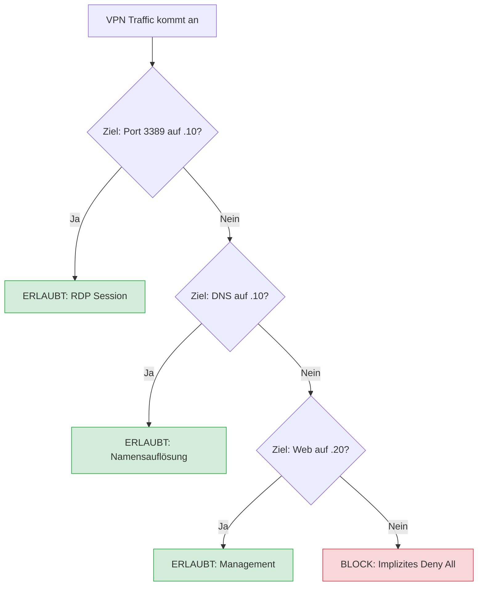

# 01 02 Analyse Firewall Hardening

# 🛡️ Firewall-Härtung pfSense (Zentrale Mainz)

**Ziel:** Absicherung des internen Netzwerks durch Limitierung des VPN-Traffics auf administrativ notwendige Dienste (Least Privilege Prinzip).

## 1. Strategie: Zero Trust / Least Privilege
Nach der erfolgreichen VPN-Einrichtung wurde die standardmäßige "Allow-All"-Regel auf dem OpenVPN-Interface entfernt. Stattdessen wurde ein striktes Regelwerk implementiert.

## 2. Implementierte Firewall-Regeln (OpenVPN Tab)

|Aktion|Protokoll|Quelle|Ziel|Ziel-Port|Zweck|
|---|---|---|---|---|---|
|PASS|ICMP|VPN_Net|Any|*|Netzwerkdiagnose (Ping)|
|PASS|TCP/UDP|VPN_Net|192.168.13.10|53|DNS-Auflösung via AD-Server|
|PASS|TCP|VPN_Net|192.168.13.10|3389|Remote Desktop (RDP) Administration|
|PASS|TCP|VPN_Net|192.168.13.20|80, 443|Management des Mail/Web-Servers|
|PASS|TCP|VPN_Net|192.168.13.1|443|Zugriff auf pfSense Web-Configurator|

## 3. Logischer Prüfprozess (Mermaid)

## 4. Validierung der Härtung
- [x] **Erfolgreich:** RDP-Verbindung zum Windows Server möglich.
- [x] **Erfolgreich:** Zugriff auf die Web-Oberfläche der pfSense via VPN.
- [x] **Gesperrt:** Zugriff auf nicht definierte Ports (z. B. SSH auf den Windows Server) wird nun aktiv durch die Firewall verworfen.
