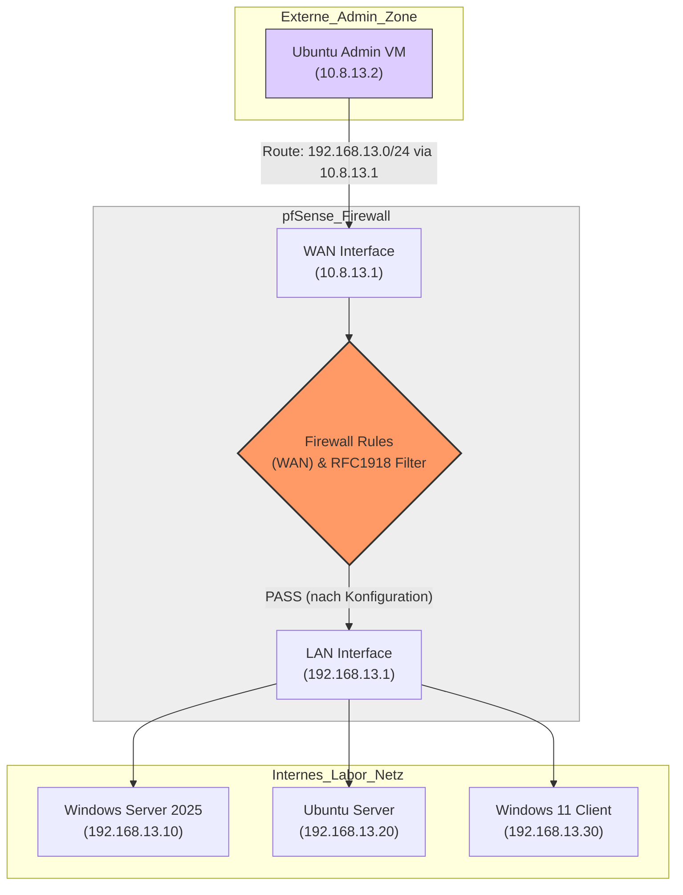
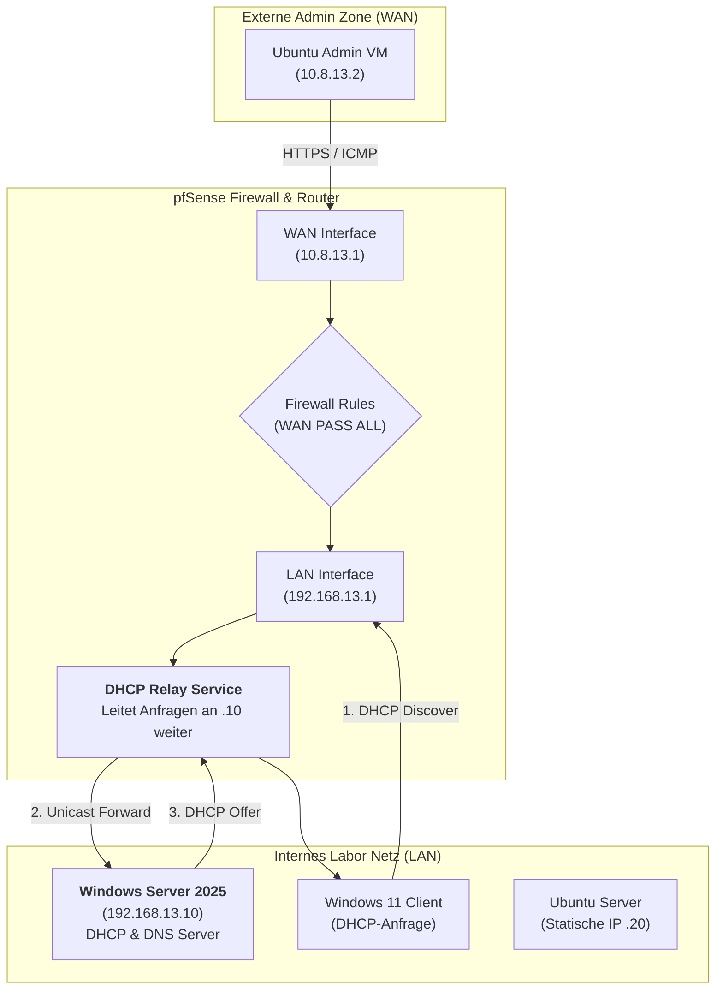

# 01 03 Analyse Netzwerk Diagramme

# 📊 Netzwerk-Diagramme (Mermaid Sammlung)

## 0. Importierte Architektur-Skizzen

### Standort- und Rollenuebersicht

Die Skizze verankert das Projekt fachlich zwischen `Mainz` als Zentrale und `Kaiserslautern` als Regional-Hub. Sie eignet sich als Management-Uebersicht vor den technischen Detaildiagrammen.

### Layer-Topologie Mainz

Die Darstellung passt zur dokumentierten Zielarchitektur mit redundanter Core-Schicht, getrennten Access-Segmenten und Firewall-Uplink zur pfSense.

## 1. Physische & Logische Topologie

## 2. DHCP Relay Prozess

