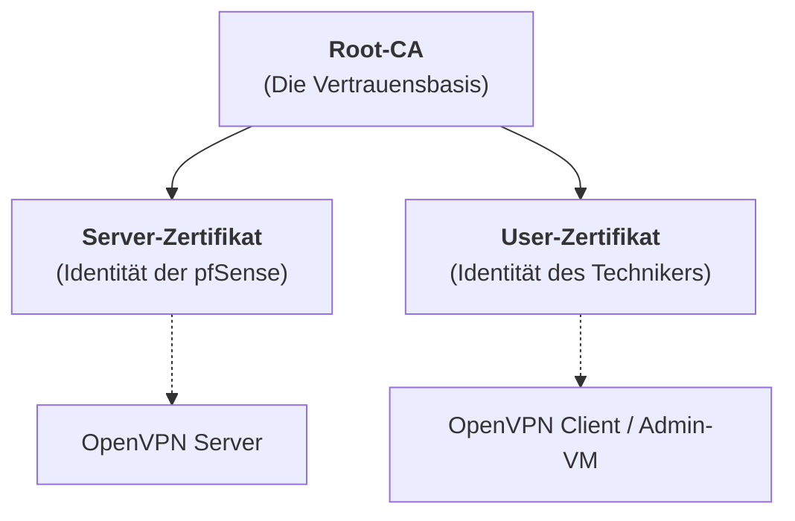

# 01 07 Analyse Zertifikats Struktur

# 🔐 PKI & Zertifikats-Struktur

```mermaid
graph TD
    CA["<b>Root-CA</b><br/>(Die Vertrauensbasis)"]
    
    CA --> SC["<b>Server-Zertifikat</b><br/>(Identität der pfSense)"]
    CA --> UC["<b>User-Zertifikat</b><br/>(Identität des Technikers)"]
    
    SC -.-> VPN[OpenVPN Server]
    UC -.-> Client[OpenVPN Client / Admin-VM]
```
