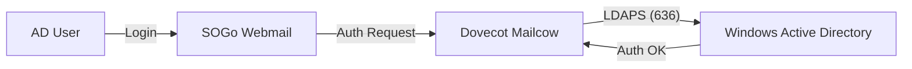

# 🛠️ Technischer Guide: Mailcow AD/LDAP Integration

**Ziel:** Anbindung des Mailcow-Mailservers an das Windows Active Directory zur zentralen Benutzerauthentifizierung.

## 1. Voraussetzungen
- Laufende Mailcow-Instanz auf Ubuntu-Server (`/opt/mailcow-dockerized/`).
- Windows Server 2025 mit konfiguriertem AD DS.
- DNS-Eintrag für `mail.betatrade.beta` zeigt auf die Linux-IP.

## 2. Durchführung: Mailcow Vorbereitung

### 2.1 DNS-Anpassung (Unbound)
Damit der Mailserver das AD finden kann, muss der interne DNS-Resolver (Unbound) angepasst werden.

Datei: `/opt/mailcow-dockerized/data/conf/unbound/unbound.conf`
```conf
local-zone: "beta." transparent
domain-insecure: "beta"

stub-zone:
  name: "beta"
  stub-addr: 10.0.x.x  # IP des Windows Domain Controllers
```
*Nach der Änderung:* `docker compose restart unbound-mailcow`

### 2.2 AD-Seitige Vorbereitung
1. Erstellung eines **LDAP-Bind-Users** (z. B. `svc_mailcow`) im Active Directory.
2. Sammeln der Parameter:
   - **Base DN:** `OU=Users,DC=beta,DC=local` (Beispiel)
   - **Bind DN:** `CN=svc_mailcow,OU=ServiceAccounts,DC=beta,DC=local`

## 3. LDAP-Konfiguration in Mailcow
Die Konfiguration erfolgt über das Admin-Panel (`mail.betatrade.beta/admin`).

| Feld | Wert (Beispiel) |
| :--- | :--- |
| **Hostname** | `dc01.beta.local` |
| **Port** | `636` (LDAPS) |
| **Base DN** | `DC=beta,DC=local` |
| **Username Field** | `sAMAccountName` |
| **Filter** | `(&(objectClass=user)(objectCategory=person))` |

> [!TIP]
> **Screenshot-Platzhalter:** Hier Screenshot der ausgefüllten LDAP-Maske in Mailcow einfügen.
> `![[mailcow_ldap_config.png]]`

## 4. Validierung & Test
1. **Verbindungstest:** Schaltfläche "Test Connection" in Mailcow nutzen.
2. **Login-Test:** Anmeldung am SOGo Webinterface (`mail.betatrade.beta/sogo`) mit einem AD-User.
3. **Log-Prüfung:** `docker compose logs --tail=100 dovecot-mailcow` bei Login-Problemen.

## 5. Visualisierung

samaccountname