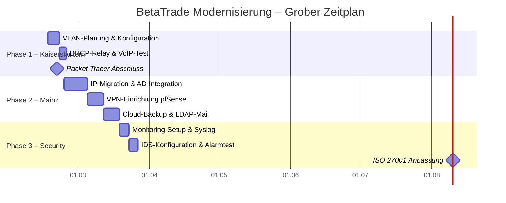

## Tag 2: Projektstruktur & Risikoanalyse

**Datum:** 17.02.2026  
**Status:** ✅ Erledigt

### Tagesziele (PM-2)

- [x] Meilensteine definieren (Was macht BetaTrade zum "Projekt"?)
- [x] Erstellung einer groben GANTT-Planung
- [x] Identifikation von 5-7 Projektrisiken
- [x] Projektstruktur & Abhängigkeiten visualisieren

### Aufgabenliste

1. GANTT-Tool: Phasen & Abhängigkeiten visualisieren
2. Risiko-Liste: Was könnte bei VLAN-Konfig oder VPN schiefgehen?
3. Struktur: Welche Phase ist am aufwendigsten? (Phase 2 Mainz)

### Notizen & Ergebnisse

- **Meilensteine**:
  - Packet Tracer Datei Kaiserslautern fertig
  - VLANs & DHCP-Relay funktionieren
  - VPN-Zugang Zertifikats-basiert live
  - Cloud-Backup automatisiert & getestet
  - IDS-Alarmtest erfolgreich
  - ISO 27001 Maßnahmen umgesetzt

- **GANTT-Plan** (Screenshot in Ordner + Mermaid):

### Detaillierte Risiko-Analyse

Zusätzlich zur Identifikation wurde eine Bewertung nach Eintrittswahrscheinlichkeit (W) und Auswirkung (A) vorgenommen (Skala 1-3).

| # | Risiko | W | A | Prio (WxA) | Maßnahme |
|---|---|---|---|---|---|
| 1 | **DHCP-Migration** (Adresskonflikte) | 3 | 2 | **6 (Hoch)** | Parallelbetrieb + kurze Leases |
| 2 | **VPN-Lockout** (Admin ausgesperrt) | 2 | 3 | **6 (Hoch)** | Lokaler Notfall-User auf Konsole |
| 3 | **STP-Loop** (Broadcast-Sturm) | 2 | 3 | **6 (Hoch)** | Rapid-PVST + BPDU Guard |
| 4 | **VoIP-Qualität** (Jitter) | 2 | 2 | 4 (Mittel) | QoS-Policy + Voice-VLAN 40 |
| 5 | **Zertifikats-Verzug** | 2 | 2 | 4 (Mittel) | Nutzung interner CA |
| 6 | **Backup-Restore Fehler** | 1 | 3 | 3 (Mittel) | Wöchentlicher Restore-Test |
| 7 | **User-Akzeptanz** | 2 | 2 | 4 (Mittel) | Frühzeitige Kommunikation |

# Tag 2: Vertiefte Projektplanung & Methodik (Ergänzung)

> **INFO:** Fokus
> Detaillierte Ausarbeitung der Projektmethodik zur Absicherung gegen zeitliche Verzögerungen und Scope Creep.

## 1. Methodik der Gantt-Planung
- **Abhängigkeiten:** Etablierung logischer Finish-to-Start-Verknüpfungen in der Planung.
- **Kritischer Pfad:** Beispielhafte Festlegung, dass die DHCP-Infrastruktur zwingend fehlerfrei laufen muss, bevor das Voice-VLAN (VoIP) ausgerollt wird.

## 2. Design der Risikomatrix
- Erläuterung der Bewertungskriterien: Die Risiken werden quantifiziert nach der Formel `Eintrittswahrscheinlichkeit × Schadensausmaß`.

## 3. Scope-Definition (Abgrenzung)
> **WARNING:** Out of Scope
> Explizites Festhalten der Aufgaben, die **nicht** Teil dieses Projekts sind, um Erwartungen des Kunden zu managen:
> - Keine Endanwenderschulungen für die neuen VPN-Zugänge.
> - Keine Beschaffung oder Einrichtung physischer Endgeräte (PCs/Laptops).
