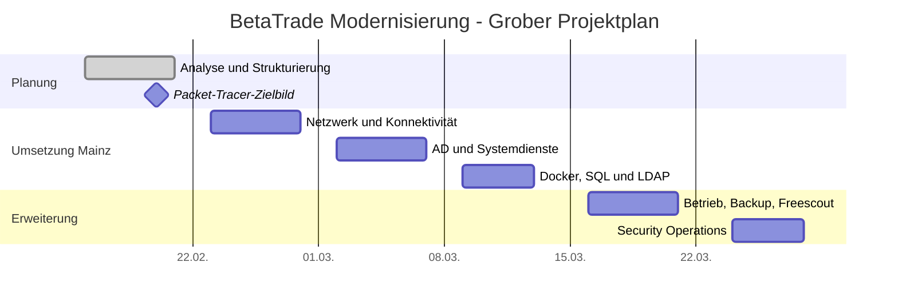

# 02 01 Tag 2 Projektstruktur Risikoanalyse

**Datum:** 17.02.2026  
**Rolle:** Projektassistenz / Planung

## Ziel des Tages
Die Projektphasen wurden zeitlich strukturiert, die wichtigsten Risiken bewertet und der Leistungsumfang klar abgegrenzt.

## Durchgeführte Arbeitsschritte
1. Groben Projektablauf für Planung, Netzwerktechnik, Systemadministration und Security vorbereitet.
2. Risiken für DHCP-Migration, VPN-Zugang, STP, VoIP und Backup erfasst.
3. Eintrittswahrscheinlichkeit und Auswirkung in einer einfachen Matrix bewertet.
4. Umfang des Projekts gegen nicht beauftragte Leistungen abgegrenzt.
5. Priorisierte Risiken für die Umsetzungswochen in das Risiko-Register übernommen.

## Lösung der Tagesaufgaben

### Gruppenarbeit

#### 1. Check-in und Projektmanagement-Grundlagen
- Probleme des Vortags wurden als überschaubar bewertet, weil Zugriffe und Dokumentationsbasis funktionierten.
- Das Vorhaben wurde als Projekt und nicht als Routinearbeit eingeordnet, weil:
  ein klarer Start- und Endpunkt existiert,
  mehrere Teilphasen voneinander abhängen,
  unterschiedliche Fachbereiche beteiligt sind,
  Risiken, Meilensteine und Übergabepunkte explizit gesteuert werden müssen.
- Meilensteine wurden als fachliche Zwischenziele definiert, die für die weitere Planung und Kontrolle relevant sind.

#### 2. Projektphasen verstehen
- Phase 1 wurde als kürzere Planungsphase eingeordnet, weil sie vor allem Zielbild, Segmentierung, Adressierung und Packet-Tracer-Vorbereitung umfasst.
- Phase 2 wurde als aufwändiger erkannt, weil dort reale Infrastruktur, Migration, Fernzugriff, zentrale Dienste, AD und Applikationen zusammenkommen.
- Daraus folgt:
  Die meiste technische Komplexität und das größte Betriebsrisiko liegen in Mainz.

#### 3. Erste GANTT-Planung erstellen
- Eine grobe Zeitplanung für die drei Phasen wurde in Arbeitsblöcke zerlegt:
  Woche 1 Planung,
  Woche 2 Netzwerk und Konnektivität,
  Woche 3 Systemdienste und AD,
  Woche 4 Docker, SQL und Integration,
  nachgelagert Security und Monitoring.
- Sinnvolle Meilensteine wurden festgelegt:
  Packet-Tracer-Zielbild fertig,
  VPN funktioniert,
  DHCP/DNS stabil,
  AD einsatzbereit,
  Mail- und Ticketsystem anschlussfähig.
- Abhängigkeiten wurden erkannt:
  ohne sauberes Netzwerk keine stabilen zentralen Dienste,
  ohne DNS/DHCP kein belastbares AD,
  ohne AD keine saubere LDAP-Integration.

##### Grobe Zeitachse

### Einzelarbeit

#### 1. Projekt strukturieren
- Die drei Hauptphasen wurden mit ihren Zielen beschrieben:
  Phase 1 = Planung und Zielbild Kaiserslautern,
  Phase 2 = Modernisierung Mainz und Aufbau zentraler Dienste,
  Phase 3 = Security, Monitoring und Compliance.
- Als aufwändigste Phase wurde Phase 2 bewertet, weil hier die meisten technischen Abhängigkeiten und Betriebsrisiken zusammenlaufen.

#### 2. Erste Risiken identifizieren
- Wesentliche Risiken dokumentiert:
  DHCP-Konflikte bei Migration,
  VPN-Fehlkonfiguration mit Zugriffsverlust,
  STP-/Loop-Probleme,
  VoIP-Qualitätsprobleme,
  Zeitverzug bei Zertifikaten,
  fehlgeschlagene Backups bzw. Restores,
  Akzeptanzprobleme bei Anwendern.
- Diese Risiken wurden mit Eintrittswahrscheinlichkeit und Auswirkung bewertet und in das Risiko-Register überführt.
- Zusätzlich wurde eine Scope-Abgrenzung festgehalten:
  keine Endanwenderschulung,
  keine Beschaffung von Endgeräten,
  Fokus auf Planung, Infrastruktur, Handover und technische Dokumentation.

### Abschluss des Tages
- Projektstruktur und Phasenlogik sind dokumentiert.
- Die Risiken wurden nicht nur gesammelt, sondern fachlich priorisiert.
- Die Ergebnisse sind als Grundlage für die Detailanalyse an Tag 3 gespeichert.

## Entscheidung und Begründung
**Ausgangslage:** Vor der eigentlichen Umsetzung war unklar, welche Aufgaben zwingend aufeinander aufbauen und welche Risiken zuerst behandelt werden müssen.

**Gewählte Option:** Es wurde eine kompakte Risikomatrix mit priorisierten Maßnahmen und ein grober Ablaufplan erstellt.

**Warum diese Option:** Die Kombination aus Zeitplan und Risikoanalyse macht nachvollziehbar, warum zuerst die Netzwerk- und Zugriffsgrundlagen und danach AD, Docker und Integration umgesetzt werden.

**Nachweis:** Risiko-Matrix, Projektchronik und Risiko-Register referenzieren dieselben Kernrisiken und Massnahmen.

## Ergebnis des Tages
- Priorisierte Projektrisiken dokumentiert
- Reihenfolge der Umsetzung fachlich begründet
- Projektumfang für den Kunden klarer beschrieben
- Grundlage für spätere Entscheidungs- und Übergabedokumente geschaffen

## Optionale Screenshots
1. Risiko-Register mit den übernommenen Hoch-Prioritäts-Risiken

Der Gantt-Plan ist bereits als Mermaid-Diagramm enthalten. Die Scope-Abgrenzung und Aufgabenübersicht sind im Text ausreichend dokumentiert.

## Verweise
- [04_02_Risiko_Register.md](../../03_Uebergabe_und_Archiv/04_02_Risiko_Register.md)
- [00_01_Masterdokumentation.md](../../00_Projekt-Übersicht/00_01_Masterdokumentation.md)

