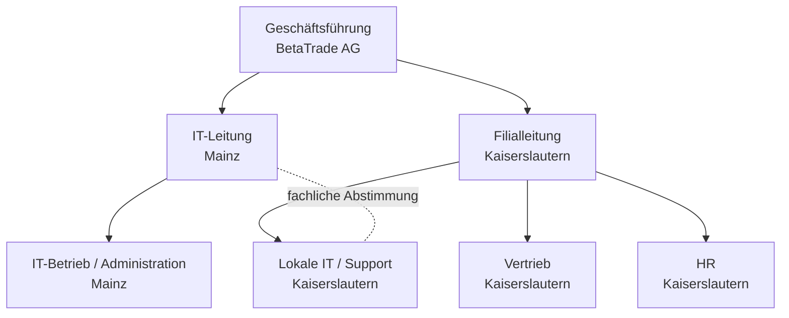
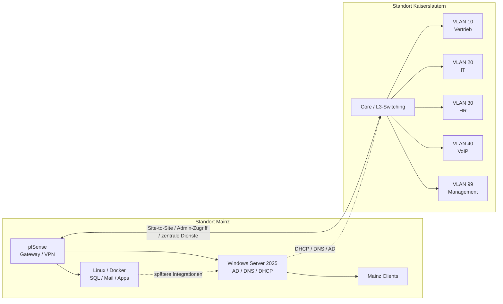
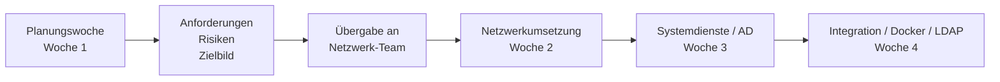

# 02 01 Tag 4 Finalisierung Übergabe

**Datum:** 19.02.2026  
**Rolle:** Planung / Übergabevorbereitung

## Ziel des Tages
Die Umsetzungsvorbereitung für Themenfeld 2 wurde in eine kundentaugliche Form gebracht und die technischen Startparameter für das Netzwerkteam zusammengefasst.

## Durchgeführte Arbeitsschritte
1. VLANs, Namensschema und IP-Logik für Kaiserslautern final zusammengestellt.
2. Packet-Tracer-Ausgangslage auf fehlende VLANs, Routing, STP und Voice-Konfiguration geprüft.
3. Übergabepunkte für die Umsetzung in Mainz und Kaiserslautern dokumentiert.
4. Risiken und offene Fragen für Hardware, VoIP und Management-Zugriff markiert.
5. Struktur für spätere Betriebs- und Abschlussdokumente vorbereitet.

## Lösung der Tagesaufgaben

### Gruppenarbeit

#### 1. Lösungsansätze diskutieren und bewerten
- Die an Tag 3 entwickelten Lösungsansätze wurden verglichen und auf Praxistauglichkeit bewertet.
- Als praktikabelste Variante wurde die Kombination aus klarer VLAN-Segmentierung, zentralen Diensten in Mainz und sicherem Fernzugriff über pfSense/VPN festgelegt.
- Für die Umsetzung wurde priorisiert:
  zuerst Netz- und Zugriffsbasis,
  danach zentrale Dienste,
  danach Integrationen und Security-Erweiterungen.

- Für Themenfeld 2 wurde eine grobe Arbeitslogik vorbereitet:
  Netzwerkgrundlagen und Segmentierung,
  DHCP/DNS,
  VPN,
  danach AD,
  später Docker, SQL und LDAP.
- Die Dokumentationsstruktur wurde so geplant, dass Tagesprotokolle, Analysen, Phasen und Übergabe getrennt, aber nachvollziehbar verbunden sind.
- Das Netzwerk-Team benötigt aus der Planungswoche vor allem:
  VLAN- und IP-Konzept,
  Packet-Tracer-Bestandsaufnahme,
  priorisierte Anforderungen,
  Risiken und offene Fragen.

### Einzelarbeit

#### 1. Übergabe-Dokumentation erstellen
- Die Erkenntnisse der Planungswoche wurden in eine übergabefähige Struktur überführt:
  Projektüberblick,
  Phasenbeschreibung,
  priorisierte Anforderungen,
  empfohlene Lösungsansätze,
  Risiken und offene Punkte.
- Damit ist die Aufgabe des Tages inhaltlich gelöst und für das nachfolgende Umsetzungsteam nutzbar gemacht.

#### 2. Packet-Tracer-Datei sichten
- Die bereitgestellte Packet-Tracer-Ausgangslage wurde fachlich als teilvorkonfiguriert eingeordnet.
- Als noch zu planende bzw. zu prüfende Punkte wurden festgehalten:
  VLAN-Zuordnung,
  Trunking,
  Inter-VLAN-Routing,
  STP-Schutzmechanismen,
  Voice-VLAN bzw. VoIP-Einbindung,
  DHCP-Relay-Konzept.
- Diese Beobachtungen wurden für das Netzwerk-Team dokumentiert.
- Zusätzlich aus der Sichtung abgeleitet:
  `ip routing` muss auf den Core-Switches aktiv sein,
  VTP sollte vorzugsweise im Modus `transparent` betrieben werden,
  bei Voice-VLAN und IP-Telefonen ist das PoE-Budget der Access-Switche zu prüfen.

#### 3. BetaTrade-Organisationsstruktur visualisieren
- Die inhaltliche Struktur für Organigramm und Infrastrukturdiagramm wurde vorbereitet:
  Geschäftsführung,
  IT,
  Filialleitung bzw. Filiale Kaiserslautern,
  getrennte Betrachtung von Mainz und Kaiserslautern.
- Da im Repo kein eigenes finales Organigramm als Datei in Woche 1 abgelegt ist, wurde die Visualisierung inhaltlich in die Übergabevorbereitung übernommen:
  organisatorische Rollen,
  Standorte,
  Netzsegmente und zentrale Systeme sind für eine spätere grafische Umsetzung beschrieben.

##### Organigramm BetaTrade AG

##### Infrastrukturdiagramm Mainz und Kaiserslautern

### Konkrete Übergabepunkte an das Netzwerk-Team
- VLAN-IDs und Namenskonventionen:
  10 Vertrieb, 20 IT, 30 HR, 40 VoIP, 99 Management
- IP-Logik:
  `10.13.X.0/24` mit Zuordnung nach VLAN-ID
- DHCP-Strategie:
  zentrales Service-Modell via DHCP-Relay
- Hardware-Grundannahme:
  Core-/Access-Switching mit späterem Redundanz- und HSRP-Zielbild

### Formale Handover-Checkliste
- [x] VLAN-IDs definiert
- [x] IP-Adressbereiche zugewiesen
- [x] DHCP-Relay-Strategie beschrieben
- [x] Risiken und offene Fragen dokumentiert
- [x] Packet-Tracer-Ausgangslage bewertet

##### Übergabefluss Planung zu Umsetzung

### Abschluss des Tages
- Die Lösungsansätze sind bewertet und priorisiert.
- Die Übergabe an das Netzwerk-Team ist fachlich vorbereitet.
- Die Packet-Tracer-Ausgangslage wurde gesichtet und die noch offenen Konfigurationspunkte sind dokumentiert.

## Entscheidung und Begründung
**Ausgangslage:** Das Umsetzungsteam benötigte eine klare Startkonfiguration, damit die technische Arbeit ohne Rückfragen an die Planungswoche anschließen kann.

**Gewählte Option:** Die Übergabe wurde als kompakter technischer Startsatz mit VLAN-/IP-Konzept, offenen Punkten und Prioritäten vorbereitet.

**Warum diese Option:** Dadurch bleibt für den Kunden nachvollziehbar, welche Vorgaben aus der Planungsphase in die spätere Implementierung übernommen wurden.

**Nachweis:** Packet-Tracer-Analyse, Phasenkonzept und Übergabeprotokoll greifen dieselben Eckdaten auf.

## Ergebnis des Tages
- Startparameter für Themenfeld 2 dokumentiert
- typische Konfigurationslücken in der Ausgangslage erkannt
- offene Punkte für Kunde und Technikteam klar benannt
- Übergabefähige Planungsdokumentation erstellt

## Optionale Screenshots
1. Packet-Tracer-Topologie oder Inventaransicht
2. Beispiel für eine erkannte Konfigurationslücke im Simulator

Organigramm, Infrastrukturübersicht und Übergabefluss sind bereits als Mermaid-Grafiken im Dokument enthalten. Ein zusätzlicher Screenshot des Übergabedokuments ist nicht mehr nötig.

## Verweise
- [03_01_Phase_1_Kaiserslautern_Konzept.md](../../02_Phasen/Phase_1_Kaiserslautern/03_01_Phase_1_Kaiserslautern_Konzept.md)
- [01_04_Analyse_Packet_Tracer.md](../Analysen/01_04_Analyse_Packet_Tracer.md)
- [04_03_Uebergabe_Protokoll.md](../../03_Uebergabe_und_Archiv/04_03_Uebergabe_Protokoll.md)

