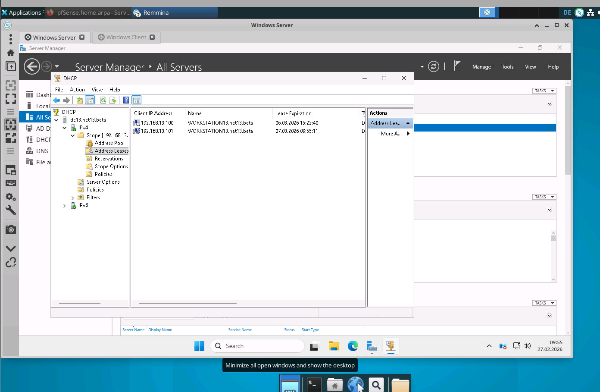

**Datum:** 2026-02-26 **System:** Windows Server 2025 (`192.168.13.10`) **Status:** ✅ Abgeschlossen

***

## 🗺️ Planfigur: DHCP Service-Struktur

Diese Darstellung zeigt, wie der Windows Server nun als autorisierter DHCP-Geber im Netz fungiert.


```d2
direction: right

"Infrastruktur": {
  pfSense: {
    label: "pfSense Gateway\n192.168.13.1"
    shape: rectangle
  }

  "Windows Server 2025": {
    label: "🗄️ DHCP-Server\n192.168.13.10"
    shape: cylinder
    style: {
      fill: "#dcfce7"
      stroke: "#166534"
      stroke-width: 2
    }
  }
}

"Konfiguration: Labor_Netz_13": {
  style: { stroke-dash: 5 }
  
  "Adress-Pool": {
    label: "Bereich: .100 bis .130\nMaske: 255.255.255.0"
  }
  
  "Optionen": {
    label: "GW: 192.168.13.1\nDNS: 192.168.13.10"
  }
}

"Infrastruktur"."Windows Server 2025" -> "Konfiguration: Labor_Netz_13": "Verteilt"
"Infrastruktur".pfSense -> "Infrastruktur"."Windows Server 2025": "Relay-Anfragen"
```

***

## 🛠️ Durchführung: Schritt-für-Schritt (Server Manager)

### Schritt 1: Rollen-Installation

Im **Server Manager** wurde über `Manage` ➔ `Add Roles and Features` die Rolle **DHCP Server** hinzugefügt. Alle benötigten Features wurden dabei automatisch mitinstalliert.

### Schritt 2: Autorisierung

Über das Benachrichtigungs-Fähnchen (🚩) wurde die Konfiguration abgeschlossen. Damit ist der Server im Netzwerk (oder im AD) berechtigt, IP-Adressen zu vergeben.

### Schritt 3: Scope-Erstellung (Der Bereich)

In der DHCP-Konsole (`Tools` ➔ `DHCP`) wurde unter **IPv4** ein "New Scope" angelegt:

- **Name:** `Labor_Netz_13`
    
- **Range:** `192.168.13.100` bis `192.168.13.130`
    
- **Maske:** `255.255.255.0` (Länge: 24)
    

### Schritt 4: DHCP-Optionen

Innerhalb des Assistenten wurden die kritischen Netzwerkeinstellungen für die Clients gesetzt:

1. **Option 003 (Router):** `192.168.13.1` (Damit Clients über die pfSense ins Internet kommen).
    
2. **Option 006 (DNS):** `192.168.13.10` (Damit der Server selbst Namen auflöst).
    

***

***

## 1. RDP-Aussperrung & Notfallzugriff
- **Problem:** RDP-Zugriff auf den Windows Server schlug fehl (`Connection refused`). Das System war von außen nicht erreichbar.
- **Lösung:** Notfall-Login über die Direkt-Konsole der Virtualisierungsumgebung (Proxmox/ESXi/VirtualBox).

## 2. SSH als redundante Backdoor
> **SUCCESS:** PowerShell-Konfiguration
> Um zukünftige RDP-Ausfälle abzufedern, wurde der OpenSSH-Server als dauerhafter Notfallzugang aktiviert:
> ```powershell
> Start-Service sshd
> Set-Service -Name sshd -StartupType 'Automatic'
> ```


## Screenshot-Nachweis



## 💡 Zusammenfassung für die Dokumentation

> **SUCCESS:** Konfigurations-Checklist
> 
> - [x] **Rolle:** DHCP Server installiert.
>     
> - [x] **Autorisierung:** Erfolgreich durchgeführt.
>     
> - [x] **Bereich:** .100 bis .130 (aktiviert).
>     
> - [x] **Gateway:** pfSense (.1) hinterlegt.
>     
> - [x] **DNS:** Localhost (.10) hinterlegt.
>
