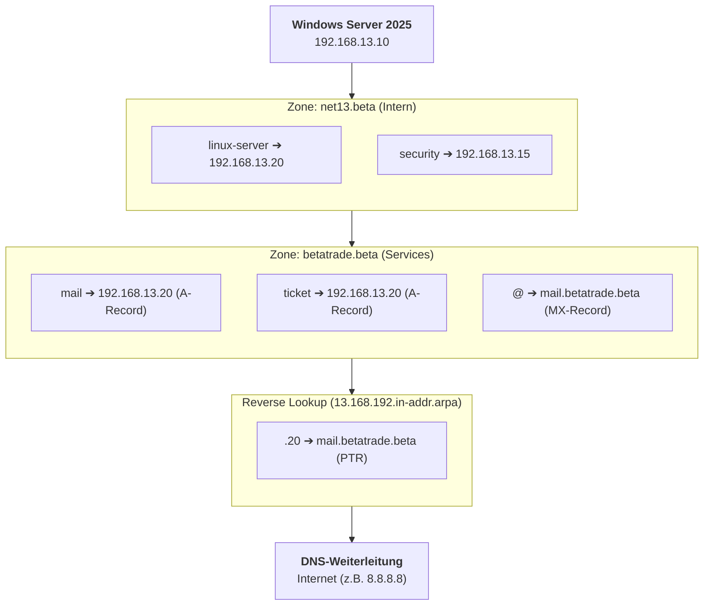
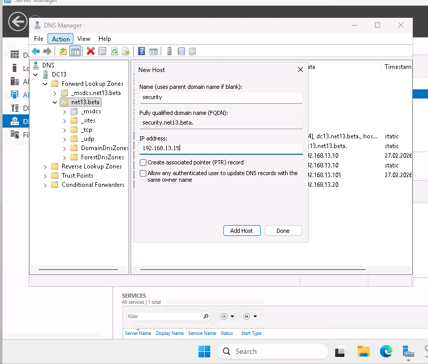

## 🗺️ DNS-Struktur (Mermaid)

Die folgende Grafik zeigt die Hierarchie der Zonen und die Zuordnung der Dienste auf dem Windows Server 2025.

***

## 🛠️ Konfigurationsdetails

### 1. Forward Lookup Zones

Es wurden zwei getrennte Zonen eingerichtet, um interne Infrastruktur und externe Firmendienste zu trennen.

#### Zone: `net13.beta`

Dient der internen Auflösung von Hostnamen innerhalb der Labor-Umgebung.

- **linux-server** (A-Record): `192.168.13.20`
    
- **security** (A-Record): `192.168.13.15`
    

#### Zone: `betatrade.beta`

Dient der Bereitstellung von Firmendiensten (Mail und Support).

- **mail** (A-Record): `192.168.13.20`
    
- **ticket** (A-Record): `192.168.13.20`
    
- **MX-Record**: Verweist auf den Hostnamen `mail.betatrade.beta` (Priorität 10).
    

### 2. Reverse Lookup Zone

Zur Ermittlung von Hostnamen basierend auf IP-Adressen wurde eine IPv4-Reverse-Lookup-Zone für das Netz `192.168.13.0` erstellt.

- **Wichtiger PTR-Record**: `.20` ➔ `mail.betatrade.beta`
    

> **WARNING:** Konfigurations-Vorgabe Für die IP-Adresse `192.168.13.20` existiert ausschließlich der PTR-Eintrag für den Mailserver. Dies ist zwingend erforderlich, um die Validierung durch externe Mail-Empfänger (Spam-Schutz) sicherzustellen.

### 3. DNS-Forwarding (Weiterleitungen)

Damit Clients auch externe Internetadressen auflösen können, wurde der DNS-Server so konfiguriert, dass er unbekannte Anfragen an öffentliche DNS-Provider weiterleitet.

- **Primärer Forwarder**: `8.8.8.8` (Google DNS)
    
- **Sekundärer Forwarder**: `1.1.1.1` (Cloudflare)
    

***

## 🔍 Verifizierung & Troubleshooting

### Test der Namensauflösung (nslookup)

Die Funktionalität wurde am Windows 11 Client mit folgenden Befehlen validiert:

1. **A-Record Test**: `nslookup mail.betatrade.beta`
    
    - Ergebnis: `192.168.13.20` ✅
        
2. **Reverse-Test**: `nslookup 192.168.13.20`
    
    - Ergebnis: `mail.betatrade.beta` ✅
        
3. **Externer Test**: `nslookup google.de`
    
    - Ergebnis: Erfolgreiche Auflösung via Forwarder ✅
