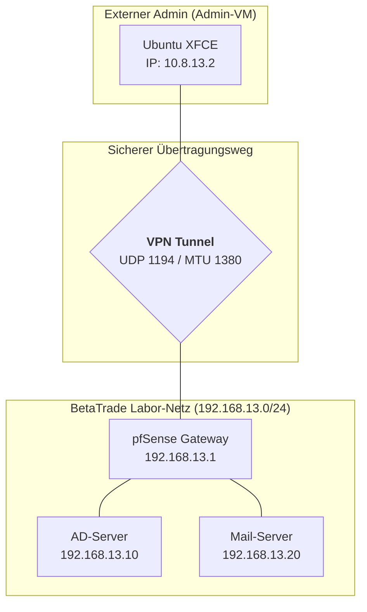
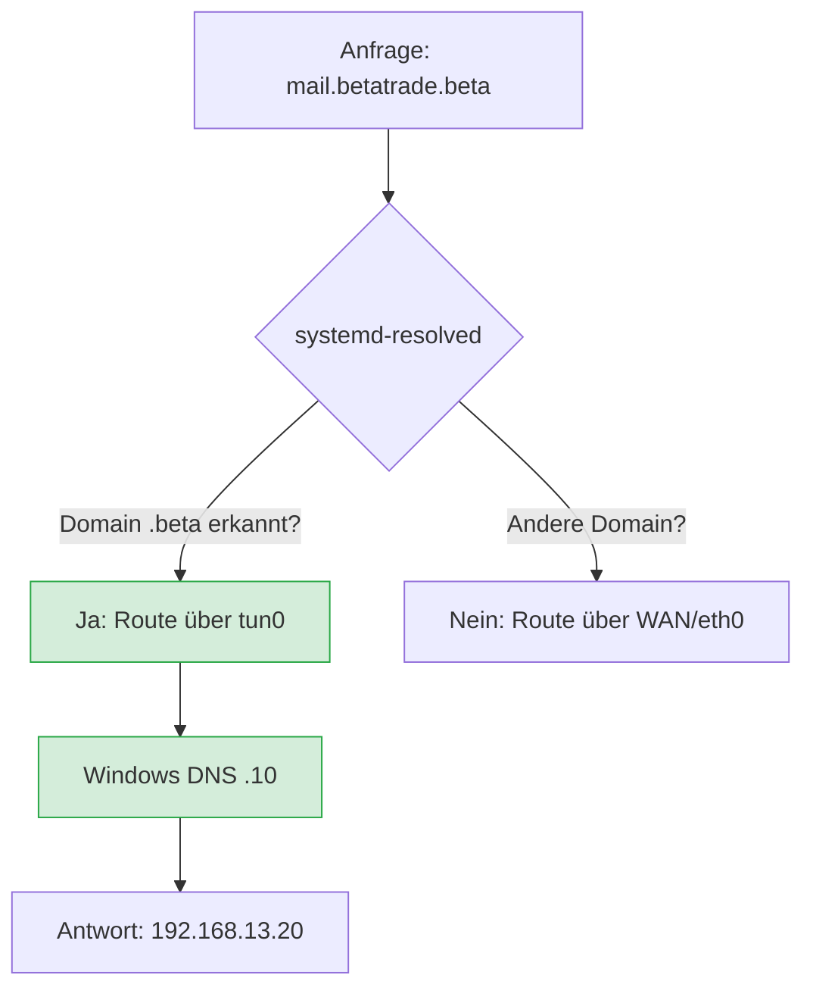

***

# 🛡️ Tätigkeitsbericht: VPN-Infrastruktur für BetaTrade AG (Labor 13)

**Datum:** 27.02.2026

**Verfasser:** Student 13

**Status:** Meilenstein 3 abgeschlossen – Sicherer Fernzugriff etabliert ✅

***

## 1. Aufbau der Vertrauensinfrastruktur (PKI)

Um die geforderte Zwei-Faktor-Authentifizierung umzusetzen, habe ich zunächst eine eigene Public Key Infrastructure auf der pfSense-Instanz aufgebaut:

- **Zertifizierungsstelle (CA):** Ich habe die `BetaTrade-Root-CA` erstellt, um als interne Vertrauensanker für alle weiteren Zertifikate zu dienen.
    
- **Server-Zertifikat:** Für den pfSense-Knoten habe ich das Zertifikat `VPN-Server-Cert` (Typ: Server Certificate) generiert, damit sich das Gateway gegenüber Clients legitimieren kann.
    
- **Benutzer-Zertifikat:** Für den administrativen Zugriff habe ich den User `admin-vpn` angelegt und ihm ein dediziertes Zertifikat (`admin-vpn-cert`) zugewiesen.
    

***

## 2. Implementierung des OpenVPN-Servers

Die Konfiguration des Servers habe ich so gewählt, dass ein optimales Gleichgewicht zwischen Sicherheit und Performance besteht:

- **Parameter:** Protokoll UDP (Port 1194), Verschlüsselung AES-256-GCM.
    
- **Adressierung:** Als Tunnel-Netzwerk habe ich `10.8.13.0/24` definiert. Das lokale Zielnetz ist mein Labor-LAN `192.168.13.0/24`.
    
- **DNS-Routing:** Ich habe konfiguriert, dass Clients automatisch meinen Windows-Server (`192.168.13.10`) als DNS nutzen, um die interne Namensauflösung im Netz `net13.beta` zu gewährleisten.
    

> **CAUTION:** Manuelle Anpassung (MTU/MSS) Da der Wizard keine MTU-Vorgaben erlaubt, habe ich manuell in den **Custom Options** die projektspezifischen Werte nachgetragen: `tun-mtu 1380; mssfix 1340;`

***

## 3. Netzwerkplan & Topologie

Die folgende Planfigur verdeutlicht den logischen Aufbau des VPN-Tunnels und die Integration in die bestehende Infrastruktur:

### Logischer Datenfluss




***

## 4. Bereitstellung und Validierung am Client

Um den Client auf meiner **XFCE-Admin-VM** einzurichten, habe ich folgende Schritte durchgeführt:

1. **Export:** Installation des `openvpn-client-export` Pakets auf der pfSense und Download der Inline-Konfiguration.
    
2. **Verbindungsaufbau:** Da GUI-Berechtigungen eingeschränkt waren, habe ich den Tunnel direkt über die Konsole gestartet: `sudo openvpn --config /home/student13/Downloads/pfSense-UDP4-1194-admin-vpn-config.ovpn`
    
3. **Ergebniskontrolle:**
    
    - **Status:** `Initialization Sequence Completed` wurde erreicht.
        
    - **Interface:** Das Interface `tun0` wurde mit der IP `10.8.13.2` und einer MTU von `1380` erfolgreich initialisiert.
        
    - **Konnektivität:** Ein Ping auf das interne Gateway (`192.168.13.1`) und den Windows-Server (`192.168.13.10`) war erfolgreich.
        

***

## 5. Fazit & Ausblick

Der VPN-Zugang ist stabil und entspricht den technischen Vorgaben (MTU/MSS/PKI). Als nächstes werde ich die **Firewall-Härtung (Schritt 4)** vornehmen, um den Zugriff innerhalb des Tunnels nach dem "Least Privilege"-Prinzip einzuschränken (z. B. RDP nur auf den AD-Server erlauben).

## 🌐 6. Erweiterte DNS-Konfiguration & Linux-Integration

Nach dem erfolgreichen Tunnelaufbau stellte sich heraus, dass der Linux-Client (Ubuntu 24.04) die vom OpenVPN-Server gepushten DNS-Einstellungen nicht automatisch in das System-Routing übernahm (**"DNS-Ignore-Problem"**).

### 🔍 Problemstellung

Trotz stehender Verbindung (`Initialization Sequence Completed`) blieb der DNS-Scope des Interfaces `tun0` auf `none`. Anfragen an die interne Domäne `net13.beta` wurden weiterhin über das physische Interface ins Leere geleitet, da der System-Resolver (`systemd-resolved`) keine Kenntnis vom VPN-DNS-Server (`192.168.13.10`) hatte.

### 🛠️ Troubleshooting & Lösungswege

Im Zuge der Fehlerbehebung wurden verschiedene Ansätze evaluiert:

1. **Versuch (Automatisiert):** Installation von `openvpn-system-resolved`.
    
    - _Ergebnis:_ Fehlgeschlagen, da das Paket im aktuellen Repository-Mirror nicht verfügbar war.
        
2. **Lösung (Manuelle Intervention):** Direkte Konfiguration des Resolvers über `resolvectl`. Dieser Weg ist vorzuziehen, da er ohne zusätzliche Drittanbieter-Skripte auskommt und tiefere Einblicke in das Linux-Netzwerk-Stack bietet.
    

### ⚙️ Implementierung des DNS-Fixes

Um die Namensauflösung für das Labornetzwerk zu erzwingen, wurden bei aktivem Tunnel folgende Befehle im Terminal abgesetzt:

Bash

```
# Zuweisung des Windows-DNS-Servers zum VPN-Interface
sudo resolvectl dns tun0 192.168.13.10

# Definition der Routing-Domain (Routing-Link-Domain)
sudo resolvectl domain tun0 ~net13.beta
```

### ✅ Validierung der Ergebnisse

Die Wirksamkeit der Maßnahme wurde durch zwei Tests bestätigt:

- **Status-Check:** `resolvectl status tun0` zeigt nun korrekt den DNS-Server `192.168.13.10` und den Scope `DNS` an.
    
- **Funktionstest:** Ein `nslookup mail.betatrade.beta` liefert nun die korrekte interne IP `192.168.13.20` zurück.
    

***

## 📉 Aktueller Logik-Fluss (DNS-Routing)




***

> **TIP:** Troubleshooting-Notiz für das Fazit Das "DNS-Ignore"-Verhalten ist eine bekannte Eigenheit moderner Linux-Distributionen im Zusammenspiel mit OpenVPN. Durch den manuellen Eingriff via `resolvectl` konnte eine saubere Trennung zwischen privatem Internet-Traffic und laborinternem DNS-Traffic (**Split-DNS**) erreicht werden, was die Stabilität der administrativen Umgebung massiv erhöht.