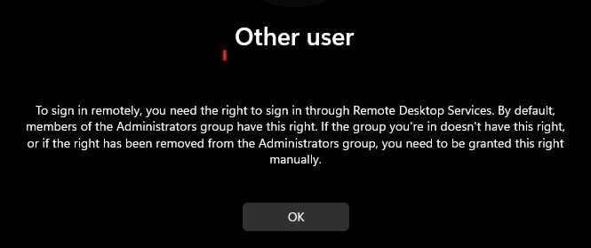
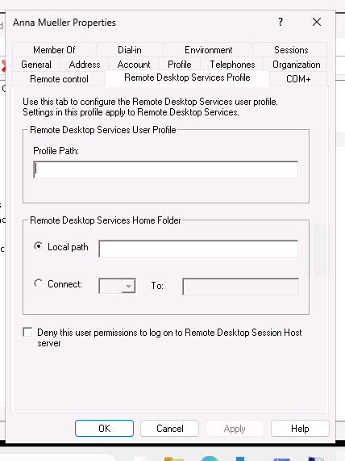
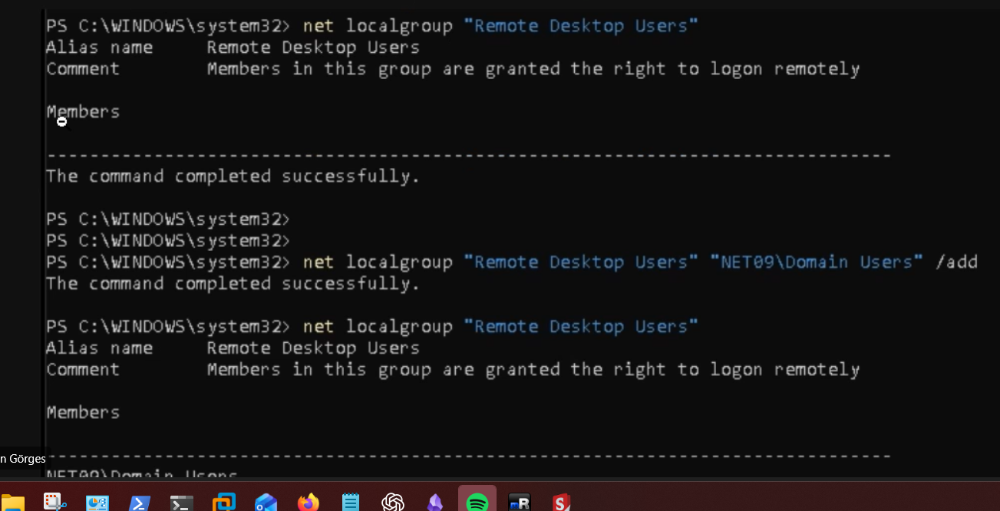
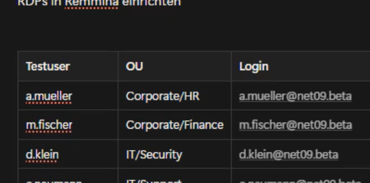

**Thema:** Active Directory Infrastruktur & Automatisierung
**Zeitraum:** Tag 1 - 2
**Verantwortlich:** Systemadministrator (AlphaTech)

***

## 🏢 Tag 1: Struktur & Benutzer-Automatisierung

**Ziel:** Aufbau der Domäne `net13.beta` und Import der Benutzer aus der CSV-Datei.

### 1.1 OU-Struktur (Design)
Statt einer manuellen Anlage wurde die Struktur basierend auf den Abteilungen automatisiert:
*   `OU=Corporate` (für HR, Finance)
*   `OU=IT` (für Security, Support)
*   `OU=Marketing` (für Digital, Events)

### 1.2 PowerShell-Import (Umsetzung)
Zur Fehlervermeidung und Standardisierung wurde folgendes Skript entwickelt und ausgefuehrt. Im final korrigierten Ablauf wurden zuerst die OUs und Sicherheitsgruppen in `DC=net13,DC=beta` angelegt, danach erfolgte der User-Import.

```powershell
# BetaTrade AD-Setup Skript
# Erstellt OUs, Security Groups und User basierend auf CSV

Import-Module ActiveDirectory

# VARIABLEN ANPASSEN
$DomainID = "net13"
$CSVPath = ".\BetaTrade_Mitarbeiterliste_net13.csv"
$DefaultPassword = ConvertTo-SecureString "BetaTrade@TQ3b!" -AsPlainText -Force
$DNSDomain = "$DomainID.beta"

# 1. OU STRUKTUR ERSTELLEN
$OUs = @("Corporate", "IT", "Marketing")
$BaseOU = "DC=$DomainID,DC=beta"

foreach ($OU in $OUs) {
    if (-not (Get-ADOrganizationalUnit -Filter "Name -eq '$OU'")) {
        New-ADOrganizationalUnit -Name $OU -Path $BaseOU -Description "Haupt-OU fuer $OU"
        Write-Host "OU $OU erstellt." -ForegroundColor Cyan
    }
}

# 2. CSV IMPORT UND VERARBEITUNG
$Users = Import-Csv -Path $CSVPath -Delimiter ","

foreach ($User in $Users) {
    # Abteilung splitten (z.B. IT-Security -> IT = Parent, Security = Child)
    $DeptParts = $User.Abteilung -split "-"
    $ParentOU = $DeptParts[0]
    
    $TargetPath = "OU=$ParentOU,$BaseOU"

    # Security Group pro Abteilung erstellen (RBAC)
    $GroupName = "GS_$($User.Abteilung)"
    if (-not (Get-ADGroup -Filter "Name -eq '$GroupName'")) {
        New-ADGroup -Name $GroupName -GroupCategory Security -GroupScope Global -Path $TargetPath
        Write-Host "Gruppe $GroupName erstellt." -ForegroundColor Yellow
    }

    # BENUTZER ANLEGEN
    $UPN = "$($User.Benutzername)@$DNSDomain"
    
    if (-not (Get-ADUser -Filter "SamAccountName -eq '$($User.Benutzername)'")) {
        $UserParams = @{
            Name                  = "$($User.Vorname) $($User.Nachname)"
            GivenName             = $User.Vorname
            Surname               = $User.Nachname
            SamAccountName        = $User.Benutzername
            UserPrincipalName     = $UPN
            EmailAddress          = $User.Email
            Path                  = $TargetPath
            AccountPassword       = $DefaultPassword
            Enabled               = $true
            ChangePasswordAtLogon = $false # Wichtig fuer RDP-Zugriff!
        }
        New-ADUser @UserParams
        Add-ADGroupMember -Identity $GroupName -Members $User.Benutzername
        
        # RDP Rechte vergeben
        Add-ADGroupMember -Identity "Remote Desktop Users" -Members $User.Benutzername
        
        Write-Host "User $($User.Benutzername) angelegt." -ForegroundColor Green
    }
}
```
### 1.3 Troubleshooting: Sicherheitsgruppe vor User-Import
**Problem:** Beim Ausfuehren des PowerShell-Skripts zur automatisierten Benutzeranlage erschien der Fehler `Cannot find an object with identity: 'SG_Corporate'`.

**Ursache:** Das Skript versuchte, Benutzer einer Sicherheitsgruppe zuzuweisen, die in der Domaene `DC=net13,DC=beta` zu diesem Zeitpunkt noch nicht existierte.

**Loesung:** Die Ausfuehrungsreihenfolge wurde korrigiert. Zuerst wurden die benoetigten OUs und Gruppen angelegt, anschliessend wurde der User-Import erneut ausgefuehrt.

***

## 🔐 Tag 2: Gruppenrichtlinien (GPOs) & Sicherheit

**Ziel:** Absicherung der Domäne und Konfiguration der Arbeitsumgebung.

### 2.1 Umgesetzte Sicherheits-Richtlinien
In der `Default Domain Policy` wurden folgende Werte gehärtet:

| Einstellung | Wert | Begründung |
| :--- | :--- | :--- |
| **Passwort-Länge** | Min. 12 Zeichen | Erhöhung der Entropie gegen Brute-Force. |
| **Passwort-Komplexität** | **Deaktiviert** | Expliziter Kundenwunsch (Usability vor Security). |
| **Passwort-Alter** | Max. 365 Tage | Jährlicher Wechsel erzwungen. |
| **Account Lockout** | 3 Versuche (30 min) | Schutz gegen Online-Angriffe. |

### 2.2 Drive Mapping (GPO Preferences)
Ein zentrales Netzlaufwerk `I:` wurde für alle Mitarbeiter bereitgestellt.
*   **Pfad:** `\\DC13\Data$` (Versteckter Share)
*   **Methode:** User Configuration > Preferences > Drive Maps
*   **Targeting:** Item-Level Targeting auf Sicherheitsgruppe `GS_Corporate-HR` etc.

### 2.3 Troubleshooting: RDP-Zugriff
**Problem:** Neu angelegte User durften sich nicht per RDP anmelden.
**Lösung:** Anpassung der `Default Domain Controllers Policy`.
*   *Policy:* User Rights Assignment > Allow log on through Remote Desktop Services
*   *Aktion:* Gruppe `Remote Desktop Users` (und damit alle Mitarbeiter) hinzugefügt.

***

## Screenshot-Nachweis









## ✅ Fazit Woche 3 (AD)
Die Identitätsverwaltung steht. Alle Benutzer können sich anmelden, erhalten ihr Laufwerk und unterliegen den definierten Sicherheitsrichtlinien. Die Basis für die LDAP-Anbindung (Mailcow) in Woche 4 ist geschaffen.
