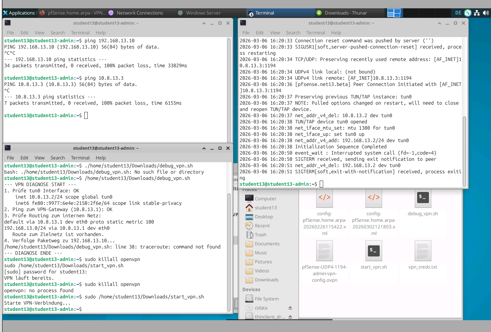

***

# Arbeitsprotokoll: VPN-Infrastruktur & Firewall-Härtung

**Datum:** 2026-03-06 **Projekt:** Sicherer Administrationszugriff via OpenVPN (pfSense) **Status:** ✅ Abgeschlossen

***

## 1. Implementierung des VPN-Autostarts (Linux)

Um sicherzustellen, dass die Admin-VM nach jedem Systemstart automatisch eine gesicherte Verbindung aufbaut, wurde ein Bash-Skript mit einer entsprechenden Desktop-Entry-Datei verknüpft.

### 1.1 Bash-Skript (`start_vpn.sh`)

Erstellung des Steuerungsskripts im Verzeichnis `/home/student13/Downloads/`.

- **Korrektur:** Dateipfade für Credentials wurden ohne `.txt` Endung angepasst, um Konsistenz mit dem Dateisystem zu gewährleisten.
    
- **Befehl:** `chmod +x start_vpn.sh` (Ausführbar machen).
    

### 1.2 Autostart-Konfiguration

Erstellung der Datei `~/.config/autostart/vpn.desktop`:

Ini, TOML

```
[Desktop Entry]
Type=Application
Name=VPN Connect
Exec=sudo /home/student13/Downloads/start_vpn.sh
Icon=network-vpn
Terminal=false
X-GNOME-Autostart-enabled=true
```

### 1.3 Passwortlose Berechtigung (Sudoers)

Damit OpenVPN im Hintergrund ohne Passwortabfrage starten kann, wurde die `visudo`-Konfiguration angepasst:

- **Eintrag:** `student13 ALL=(ALL) NOPASSWD: /usr/sbin/openvpn`
    

***

## 2. Fehlerbehebung: DNS-Resolution unter Linux

Ein bekanntes Problem beim Pushen von DNS-Optionen via OpenVPN auf Linux wurde identifiziert und behoben.

- **Zusatzpaket:** `openvpn-systemd-resolved` wurde installiert.
    
- **Anpassung der `.ovpn` Datei:** Integration der Skript-Hooks:
    
    Plaintext
    
    ```
    script-security 2
    up /usr/bin/update-systemd-resolved
    down /usr/bin/update-systemd-resolved
    ```
    

***

## 3. Netzwerk-Diagnose & Routing-Fix

Während der Tests wurde festgestellt, dass zwar der VPN-Tunnel (`tun0`) aufgebaut wurde, das interne Netz (`192.168.13.0/24`) jedoch über das falsche Interface (`eth0`) angesprochen wurde.

### 3.1 Fehleranalyse

Die Diagnose via `ip route` ergab ein falsches Gateway-Mapping. Ursache war eine Fehlkonfiguration in den OpenVPN-Servereinstellungen der pfSense.



### 3.2 Korrektur in pfSense (Tunnel Settings)

	Folgende Parameter wurden korrigier | Parameter | Vorher | Nachher (Korrekt) || :--- | :--- | :--- | | **IPv4 Tunnel Network** | `10.8.13.0/24` | `10.8.13.0/24` | | **IPv4 Local network(s)** | `10.8.13.0/24` (falsch) | `192.168.13.0/24` |

***

## 4. Firewall-Härtung (Security Best Practices)

Ziel war es, den Zugriff von außen ("WAN") vollständig zu blockieren, außer für den verschlüsselten VPN-Tunnel.

### 4.1 WAN-Regeln (Eingang)

Die Regeln wurden so sortiert, dass die Erlaubnis vor dem Verbot steht:

1. **PASS:** Protocol `UDP`, Port `1194` (OpenVPN Service).
    
2. **BLOCK:** Protocol `Any`, Source `Any`, Destination `Any` (Blockiert direkten Zugriff auf WebGUI/SSH).
    

### 4.2 OpenVPN-Regeln (Innerhalb des Tunnels)

Damit die Admin-VM im internen Netz arbeiten kann, wurde auf dem OpenVPN-Interface eine **Pass-Any-Rule** erstellt.

***

## 5. SQL-Server Vorbereitung

Die Infrastruktur ist nun bereit für die Datenbank-Migration.

- **Erreichbarkeit:** Ping auf interne Server-IP (`192.168.13.x`) ist erfolgreich.
    
- **Nächste Schritte:** * Prüfung der Bind-Address (`0.0.0.0`) in der `my.cnf` / `50-server.cnf`.
    
    - Import der Firmendatenbank via SQL-Dump.
        

***

## Verwendete Befehle (Cheat Sheet)

- `ip a | grep tun0` – Status des VPN-Tunnels prüfen.
    
- `sudo killall openvpn` – VPN-Verbindung trennen.
    
- `resolvectl status` – DNS-Auflösung prüfen.
    
- `ip route` – Routing-Tabelle kontrollieren.
