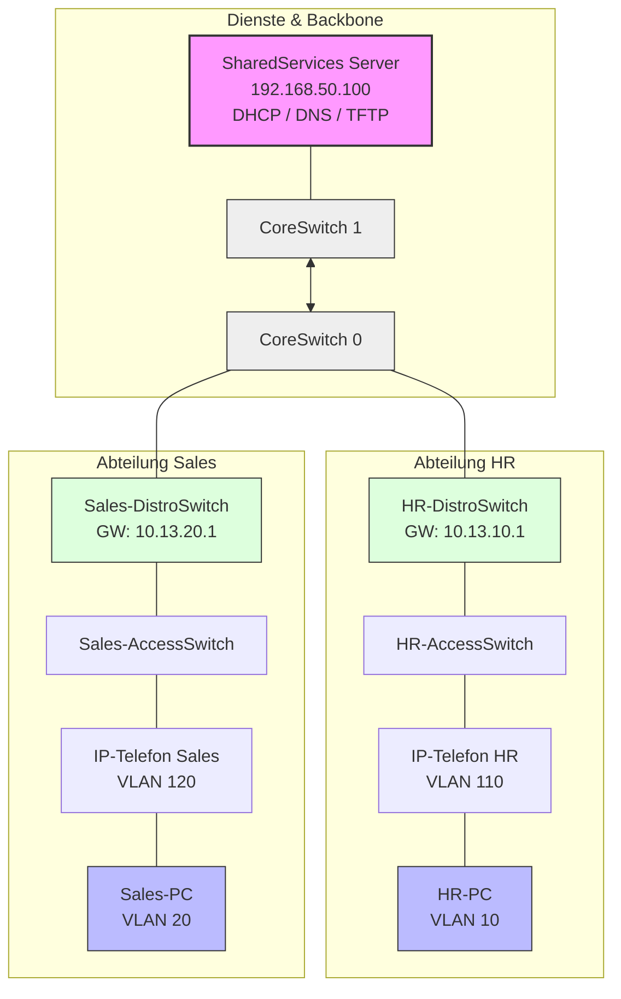
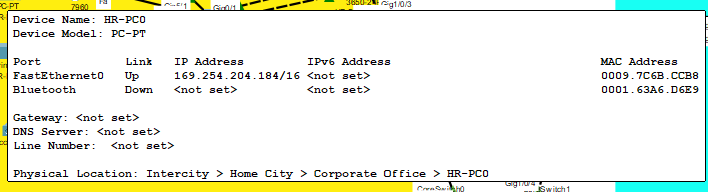

# Ausführlicher technischer Netzbericht: 03.03.2026

**Projekt:** Enterprise Multi-VLAN & VoIP Infrastructure Deployment

**Status:** Stabilisiert & Optimiert

**Verantwortlicher Admin:** Samuel Kuhlmann

***

## 1. Management Summary (Vorwort)

Am heutigen 03.03.2026 wurde die finale Phase der DHCP-Implementierung und VLAN-Segmentierung für die Standorte **HR**, **Sales** und **IT** durchgeführt. Das Hauptziel war die fehlerfreie Einbindung von Arbeitsplatzrechnern, die über IP-Telefone (Daisy-Chaining) an das Netzwerk angebunden sind. Trotz initialer Konnektivitätsprobleme (APIPA) konnte durch eine systematische Layer-für-Layer Analyse eine voll funktionsfähige Infrastruktur hergestellt werden.

Optimierter Netzwerk-Strukturplan



***

## 2. Detaillierte Problembeschreibung: Das "APIPA-Phänomen"

Zu Beginn der Schicht meldeten PCs in den Abteilungen HR und Sales den Fehler `DHCP request failed`. Die Rechner wiesen sich selbst Adressen aus dem Bereich `169.254.x.x` zu.



### Die drei Fehlerquellen:

1. **Layer 1 (Physical):** Die IP-Telefone fungieren als 3-Port-Switches. Ohne eigene Stromversorgung (da kein PoE am Switch-PT vorhanden ist) bleibt der interne Switch des Telefons inaktiv. Der PC erhält kein Signal.
    
2. **Layer 2 (Data Link):** Die Switch-Ports waren nicht für den hybriden Betrieb (Daten + Sprache) vorbereitet. Ohne `voice vlan` wurden Sprachpakete verworfen oder landeten im falschen Subnetz.
    
3. **Layer 3 (Network):** DHCP-Broadcasts endeten an den Layer-3-Schnittstellen der Distro-Switches, da kein "Bote" (Relay Agent) konfiguriert war.
    

***

## 3. Technischer Deep-Dive: Die Lösungen

### A. Die "IP-Helper" Logik (DHCP Relay)

Da der DHCP-Server in einem separaten VLAN (VLAN 50) steht, erreichen ihn die Broadcast-Anfragen der PCs (`255.255.255.255`) nicht. **Lösung:** Auf jedem VLAN-Interface (SVI) der Distribution-Switches wurde der Befehl `ip helper-address 192.168.50.100` implementiert. Dieser wandelt den Broadcast in einen gezielten Unicast um.


### B. VLAN-Datenbank & Port-Konfiguration

Ein häufiger Fehler war das Fehlen der VLANs in der globalen Datenbank. Wir haben sichergestellt, dass jedes VLAN manuell angelegt wurde:

Bash

```
vlan 10
 name HR-Data
vlan 110
 name HR-Voice
```

Nur wenn das VLAN global existiert, kann das Interface Vlan (SVI) den Status `Up/Up` erreichen.

### C. Daisy-Chaining Konfiguration

Für die kombinierten Ports (Telefon + PC) wurde folgendes Standard-Profil auf den Access-Switches ausgerollt:

- `switchport mode access`: Erzwingt den Endgeräte-Modus.
    
- `switchport access vlan [ID]`: Natives VLAN für den PC-Datenverkehr.
    
- `switchport voice vlan [ID]`: Tagged VLAN für das IP-Telefon (Cisco Discovery Protocol - CDP).
    
- `spanning-tree portfast`: Umgeht die 30-sekündige STP-Blockierung, um DHCP-Timeouts zu verhindern.
    

***

## 4. OSPF-Routing & Netz-Hygiene

Ein kritischer Fehler wurde im HR-Distro-Switch gefunden. Es gab eine Überlappung bei der OSPF-Ankündigung:

- **Fehler:** `network 192.168.40.0 0.0.0.255 area 0` (zu breit gefasst).
    
- **Korrektur:** Umstellung auf präzise `/26` Netze, um Kollisionen mit dem Sales-Voice-Netz zu vermeiden.
    

**Überarbeitete OSPF-Logik:**

Bash

```
router ospf 1
 network 10.13.10.0 0.0.0.255 area 0       # HR-Data
 network 192.168.40.0 0.0.0.63 area 0      # HR-Voice
```

***

## 5. Server-Dienste & TFTP-Provisionierung

Der SharedServices-Server übernimmt nun zwei zentrale Rollen:

1. **DNS:** Auflösung von `www.intranet.local` auf `192.168.50.100`.
    
2. **DHCP Option 150:** In den DHCP-Pools für Voice wurde die TFTP-Server-IP eingetragen.
    
    - _Wieso?_ IP-Telefone benötigen beim Booten eine Konfigurationsdatei. Ohne Option 150 im DHCP-Angebot bleiben die Telefone im Status "Configuring IP" hängen.
        

***

## 6. Sicherheits-Audit: Spanning Tree & Trunks

Wir haben heute ein "Cleanup" der Trunk-Ports durchgeführt.

- **Gefahr:** `portfast` auf einem Trunk zwischen zwei Switches kann bei einer Fehlverkabelung sofort einen **Broadcast Storm** auslösen.
    
- **Maßnahme:** Alle Trunks wurden auf Standard-STP zurückgesetzt. Die Konfiguration ist nun "Loop-Safe".
    

***

## 7. Abschluss-Checkliste & Abnahme

Am Ende des Tages wurde folgendes verifiziert:

- [x] **Ping-Test:** Jeder PC kann das Gateway (`.1`) und den Server (`192.168.50.100`) pingen.
    
- [x] **Traceroute:** Pakete von HR zu Sales nehmen den korrekten Weg über die Cores.
    
- [x] **Web-Test:** Das Intranet ist über den DNS-Namen erreichbar.
    
- [x] **Voice-Check:** Telefone zeigen keine Fehlermeldungen mehr und haben IPs aus dem `192.168.40.x` Bereich.
    

***

## 8. Ausblick für den 04.03.2026

- Implementierung von **Access Control Lists (ACLs)**, um den Zugriff zwischen den Abteilungen (z.B. HR darf nicht in das IT-VLAN) einzuschränken.
    
- Konfiguration des **CME (Cisco Unified Communications Manager Express)** für die Telefonie-Funktionen.
    

***

**Anhang: Verwendete Befehle für Troubleshooting**

- `show ip route` (Routing-Tabelle prüfen)
    
- `show vlan brief` (VLAN Zuweisung prüfen)
    
- `show ip dhcp binding` (Vergebene IPs auf dem Server/Router prüfen)
    

#networking #cisco #it-documentation #packettracer #ospf #vlan #voip
