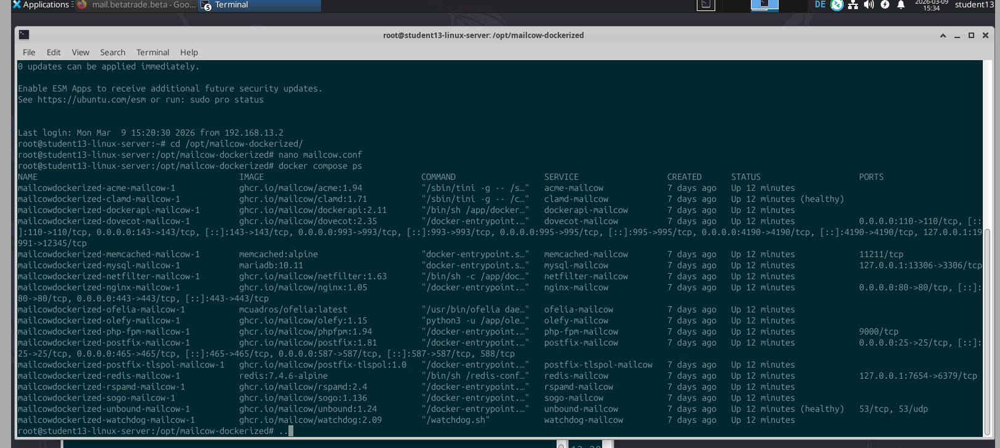
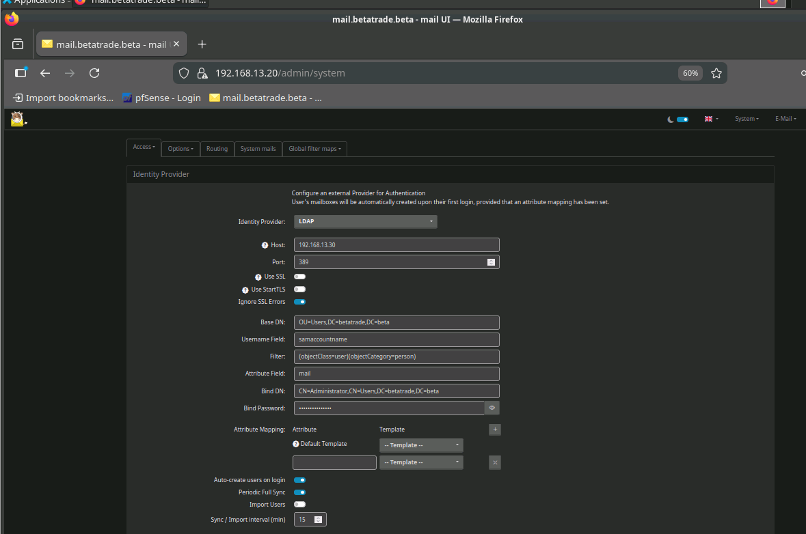
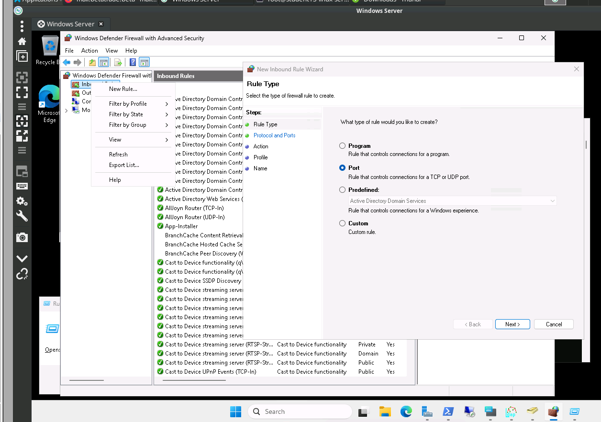
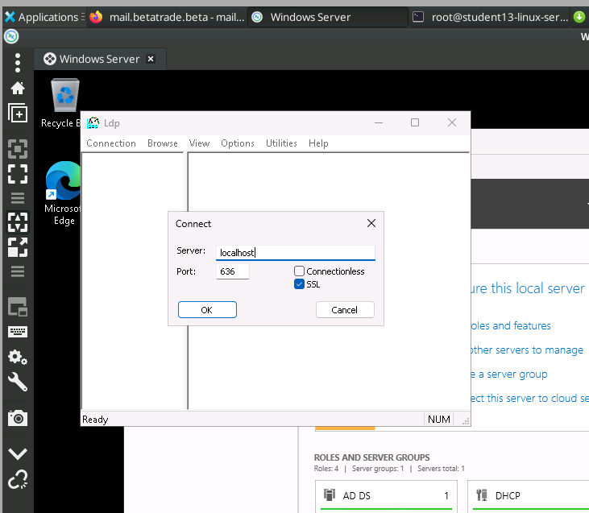

# Tag 2 (Woche 4): Windows-Linux Integration (Mailserver)

**Datum:** 10.03.2026  
**Bearbeiter:** Samuel 
## 👥 Gruppenarbeit
1. **Infrastruktur-Abstimmung:** Festlegung des Service-Accounts für den LDAP-Bind im Windows-Team.
2. **DNS-Troubleshooting:** Behebung eines Auflösungsfehlers (beta.local wurde intern nicht korrekt auf den DC geroutet).

## 2. Technische Umsetzung (Detail-Dokumentation)

### 2.1 Unbound DNS-Konfiguration
Damit der Mailserver die Domäne `net13.beta` und den DC `192.168.13.10` finden kann, musste der interne Resolver angepasst werden.

**Datei:** `data/conf/unbound/unbound.conf`
```conf
server:
  # ... (bestehende Config)
  
  # Stub-Zone für lokale Domäne
  local-zone: "net13.beta." transparent
  domain-insecure: "net13.beta"

stub-zone:
  name: "net13.beta"
  stub-addr: 192.168.13.10  # IP des Domain Controllers
```
*Aktion:* `docker compose restart unbound-mailcow`

### 2.2 LDAP-Anbindung (Mailcow UI)
Die Authentifizierung wurde im Admin-Panel unter `System > Configuration > Access > LDAP` konfiguriert.

| Parameter | Wert | Erklärung |
| :--- | :--- | :--- |
| **Server Address** | `192.168.13.10` | IP des DC |
| **Port** | `389` (StartTLS) oder `636` (LDAPS) | Hier: 636 mit "Skip Verify" (Labor) |
| **Base DN** | `DC=net13,DC=beta` | Suchbereich |
| **Bind DN** | `CN=svc_mailcow,OU=IT,DC=net13,DC=beta` | Service-User zum Lesen |
| **User Filter** | `(&(objectClass=user)(sAMAccountName=%u))` | Login via sAMAccountName |
| **Sync Interval** | `300` | Sync alle 5 Min |

### 2.3 Validierung
1. **Verbindungstest:** Button "Test Connection" -> **OK**.
2. **SOGo Login:** User `d.zimmermann` (HR) konnte sich mit AD-Passwort anmelden.
3. **Log-Check:** `docker compose logs -f dovecot-mailcow` zeigte erfolgreichen Auth-Handshake.

## 📸 Dokumentation & Screenshots


- **Screenshot 1:** Status der Mailcow-Container in Docker (`docker ps`).  
  Siehe Abbildung oben.
- **Screenshot 2:** LDAP-Konfigurationsmaske (Test Connection erfolgreich).  
  

### Ergänzende Nachweise für LDAPS






## 📝 Reflexion / Offene Punkte
- Die Integration vereinfacht die Benutzerverwaltung erheblich (Single Source of Truth im AD).
- **Lessons Learned:** Bei LDAP über Port 636 muss das Zertifikat des DCs im Mailcow-Container bekannt sein (oder "Ignore SSL Errors" temporär aktiv).
- Nächster Schritt: Einrichtung der Backup-Strategie für das gesamte Mail-System.
