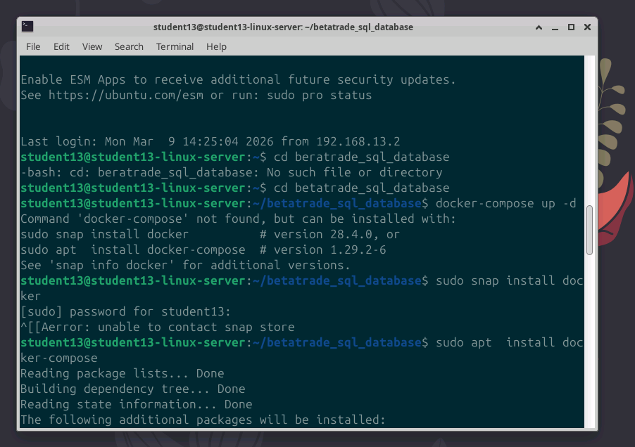
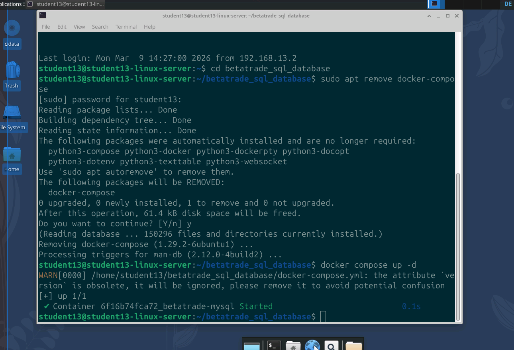
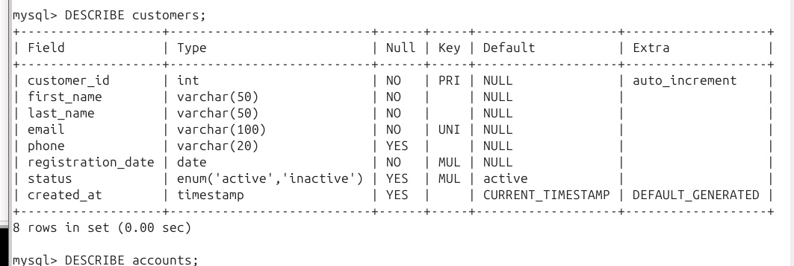
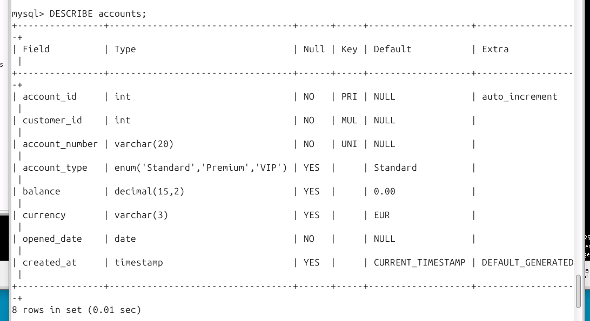
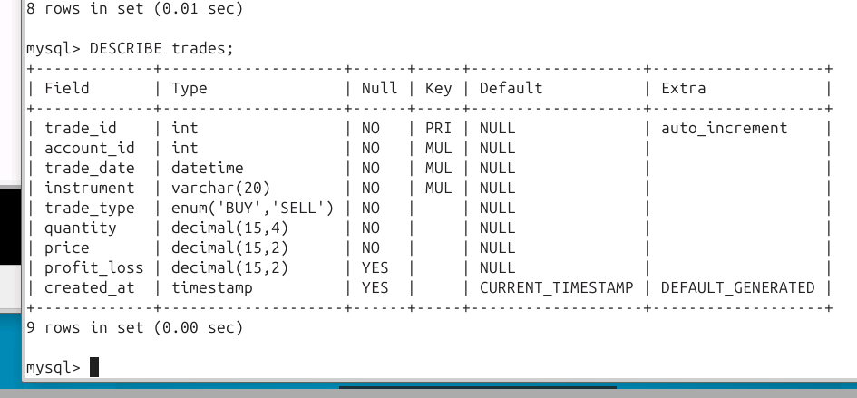

**Name:** [Dein Name]

**Datum:** [Datum]

**System:** Ubuntu Server (netXX.beta)

**Rolle:** Systemadministrator AlphaTech GmbH

***

## 1. Docker-Grundlagen

### 1.1 Docker-Umgebung & Hello-World

- **Durchführung:** Test der Docker-Installation und erste Schritte.
    
- **Befehle:**
    
    Bash
    
    ```
    docker run hello-world
    docker ps -a
    docker images
    ```
    


### 1.2 Container-Verwaltung (Cleanup)

- **Befehle zum Aufräumen:**
    
    Bash
    
    ```
    docker rm [CONTAINER_ID]
    docker rmi hello-world
    ```
## 2. BetaTrade-Datenbank Setup

### 2.1 Docker Compose

- **Analyse `docker-compose.yml`:** Die Datei definiert einen Service (MySQL/MariaDB), setzt Umgebungsvariablen für User/Passwort und mappt Ports sowie Volumes für die Daten-Persistenz.
    
- **Start der Datenbank:**
    
    Bash
    
    ```
    cd /home/studentxx/betatrade-database/
    docker-compose up -d
    docker ps

    ```
    







### 2.2 Verbindung zur Datenbank

- **Login-Befehl:**
    
    Bash
    
    ```
    docker exec -it betatrade-mysql mysql -uadmin -pbetatrade betatrade_db
    ```
    

> **[SCREENSHOT 3: Erfolgreicher Login-Prompt im MySQL-Client]**

***

## 3. Datenbank-Erkundung & SQL-Struktur

### 3.1 Tabellen-Struktur (DESCRIBE)

|Tabelle|Zweck|
|---|---|
|`customers`|Stammdaten der Kunden (Name, Email, Reg-Datum)|
|`accounts`|Kontoinformationen, verknüpft mit customer_id|
|`trades`|Transaktionsdaten, verknüpft mit account_id|

In Google Sheets exportieren

- **Befehl:** `DESCRIBE customers;`
    







***

## 4. Daten-Abfragen (Queries)

### 4.1 Filtern & Suchen (WHERE)

- **Aufgabe:** Kunden mit Status 'active'.
    
    SQL
    
    ```
    SELECT * FROM customers WHERE status = 'active';
    ```
    
- **Aufgabe:** Kunden von 2024.
    
    SQL
    
    ```
    SELECT * FROM customers WHERE registration_date >= '2024-01-01';
    ```
    

### 4.2 Aggregation & Gruppierung

- **Gesamtgewinn (SUM):**
    
    SQL
    
    ```
    SELECT SUM(profit_loss) FROM trades;
    ```
    
- **Trades pro Instrument:**
    
    SQL
    
    ```
    SELECT instrument, COUNT(*) FROM trades GROUP BY instrument;
    ```
    

> **[SCREENSHOT 5: Ergebnis der Gruppierung nach Instrumenten]**

***

## 5. Relationale Verknüpfungen (JOINs)

### 5.1 Kunden und ihre Konten

- **Abfrage:**
    
    SQL
    
    ```
    SELECT c.first_name, c.last_name, a.account_number 
    FROM customers c 
    JOIN accounts a ON c.customer_id = a.customer_id;
    ```
    

> **[SCREENSHOT 6: Liste der Kundennamen kombiniert mit Kontonummern]**

### 5.2 Komplexe Analyse (Business Question)

- **Frage:** Aktivster Kunde im März 2024?
    
- **Lösung:**
    
    SQL
    
    ```
    SELECT c.first_name, c.last_name, COUNT(t.trade_id) as trade_count
    FROM customers c
    JOIN accounts a ON c.customer_id = a.customer_id
    JOIN trades t ON a.account_id = t.account_id
    WHERE t.trade_date BETWEEN '2024-03-01' AND '2024-03-31'
    GROUP BY c.customer_id, c.first_name, c.last_name
    ORDER BY trade_count DESC LIMIT 1;
    ```
    

***

## 6. Datensicherheit & Bereinigung

### 6.1 Datenbank-Backup (Dump)

- **Durchführung:** Erstellung einer `.sql` Datei vom Host-System aus.
    
    Bash
    
    ```
    docker exec betatrade-mysql mysqldump -uadmin -pbetatrade betatrade_db > backup_day3.sql
    ```
    

> **[SCREENSHOT 7: 'ls -lh' zeigt die erstellte backup_day3.sql Datei]**

### 6.2 Test-Daten löschen

- **Befehl:** `DELETE FROM customers WHERE email = 'test.user1@betatrade-test.de';`
    

***

## 7. Reflexion

- **Docker:** Docker Compose ist deutlich effizienter als manuelle `docker run` Befehle, da die gesamte Konfiguration (Netzwerk, Volumes) versionierbar in einer Datei liegt.
    
- **SQL:** Die größte Herausforderung war der **Triple-JOIN** (Customers -> Accounts -> Trades). Wichtig ist hier, immer die Fremdschlüssel (`customer_id`, `account_id`) als Brücke zu nutzen.
    
- **Sicherheit:** Vor jedem `DELETE` sollte immer ein `SELECT` mit derselben Bedingung ausgeführt werden, um sicherzustellen, dass man nicht die falschen Zeilen löscht.
    

***
