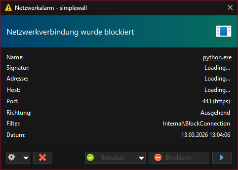
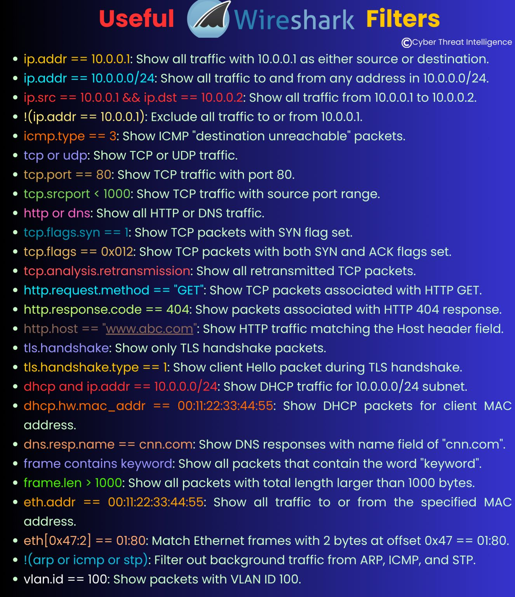

# Phase 3: Security und Monitoring

**Zeitraum:** Nach Abschluss von Phase 2  
**Status:** Vorbereitet / noch offen  
**Fokus:** Monitoring, IDS/IPS, Incident Response und ISO 27001

## Kernziele

- Zentrale Ueberwachung von Logs, Events und Netzwerkzustand aufbauen
- IDS/IPS-Mechanismen und Alerting einfuehren
- Incident-Response-Ablauf fachlich und organisatorisch absichern
- ISO-27001-relevante Kontrollen auf den erreichten Infrastrukturstand abbilden

## Geplante Bausteine

- Zentraler Syslog- oder Monitoring-Stack
- IDS-/Alerting-Konzept fuer pfSense und Server
- Review der Backup- und Restore-Nachweise
- Auditvorbereitung mit Control-Mapping und Lueckenanalyse

## Zusaetzliche Nachweise und sinnvolle Erweiterungen

### Beispiel fuer hostbasiertes Alerting

Der Screenshot aus dem Praktikumsordner zeigt einen konkreten Netzwerkwarnfall auf Host-Ebene. Auch wenn Phase 3 noch nicht operativ umgesetzt ist, laesst sich daraus ein sinnvoller Baustein fuer die Security-Phase ableiten:

- ausgehende Verbindungen unbekannter Prozesse sichtbar machen
- Freigabe- und Blockierentscheidungen dokumentieren
- Host-Alerts mit Netzwerk- und Server-Logs korrelieren

### Analyse- und Triage-Referenz

Die Wireshark-Filterreferenz eignet sich als operative Hilfe fuer die geplante Incident-Erkennung, insbesondere fuer DNS-, DHCP-, TLS- und VLAN-bezogene Untersuchungen.

## Relevante Dokumente

- [00-12a Incident Response Plan](00-12a_Incident_Response_Plan.md)
- [00-12b ISO27001 Checkliste](00-12b_ISO27001_Checkliste.md)
- [00-21 Analyse Firewall Hardening](../../01-Projekt_Themenfelder/Analysen/00-21_Analyse_Firewall_Hardening.md)
- [00-41 Risiko-Register](../../03_Uebergabe_und_Archiv/00-41_Risiko_Register.md)
- [00-42 Uebergabe-Protokoll](../../03_Uebergabe_und_Archiv/00-42_Uebergabe_Protokoll.md)

## Einordnung

Phase 3 ist noch nicht operativ umgesetzt. Die noetigen Vorarbeiten, Risiken und Leitdokumente sind jedoch vorhanden, sodass die Security-Phase direkt aus dem dokumentierten Stand von Phase 2 gestartet werden kann.
