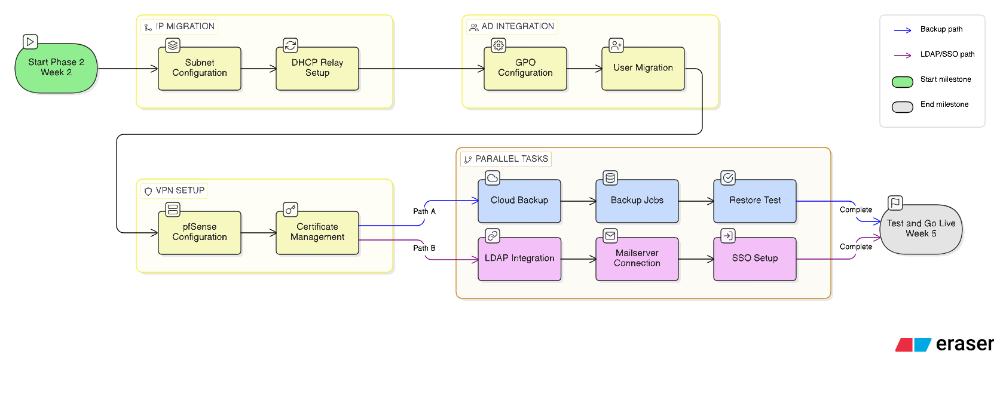

# 05 05 Screenshot Anlage

# Screenshot-Anlage – BetaTrade Modernisierung

Diese Anlage sammelt die verbleibenden Original-Screenshots, die nicht direkt in den Fliesstext der Fachdokumente eingebaut wurden. Die fachlich wichtigsten Ausschnitte sind bereits in die operativen Dokumente integriert; diese Anlage dient als vollstaendige Bildreferenz fuer den Vault.

## 1. Planungs- und Aufgabenmaterial

### 19.02.2026

**Packet-Tracer- und Planungsansicht**

### 26.02.2026

**Aufgabenblatt Migration, DNS, VPN und Firewall – Teil 1**

**Aufgabenblatt Migration, DNS, VPN und Firewall – Teil 2**

**Aufgabenblatt technische Hinweise und Abgabe**

**Weitere Aufgaben-/Kundenansicht**

## 2. Woche 2 – DHCP, DNS und VPN

### 27.02.2026

**DHCP-Konsole auf dem Windows Server**

**Netplan-/Linux-Ansicht fuer DHCP-Umstellung**

**DNS Manager mit Zonen/Records**

**OpenVPN Client GUI unter Linux**

**pfSense OpenVPN Clients**

**OpenVPN Client Export Utility**

**OpenVPN Verbindungslog**

## 3. Woche 3 – Packet Tracer und AD

### 02.03.2026

**IT Access Switch**

**Sales Access Switch**

**HR Distro Switch**

**HR Access Switch**

**CoreSwitch0**

**Sales Distro Switch**

**IT Distro Switch**

**CoreSwitch1**

**APIPA-Client HR**

**APIPA-Client IT**

**APIPA-Client Sales**

### 04.03.2026

**Windows-/Benutzeransicht aus der AD-/RDP-Fehleranalyse**

**RDP-Fehlerbild**

### 06.03.2026

**Benutzereigenschaften fuer Remote Desktop Services**

**MySQL Tabellenstruktur accounts**

**MySQL Tabellenstruktur customers**

**MySQL Tabellenstruktur trades**

**VPN-Diagnose und Debug-Skript**

**Remote Desktop Users per PowerShell**

**Testuser/Login-Uebersicht**

## 4. Woche 4 – Docker, SQL und Mailcow

### 09.03.2026

**Fehlerbild docker-compose fehlt**

**Umstellung auf Docker Compose v2**

**Mailcow Container-Status**

**Weitere Linux-/Mailcow-Terminalansicht**

### 10.03.2026

**DHCP-/DNS-Netzwerkplan**

### 11.03.2026

**Zusatzansicht Mail/LDAP**

**Mailcow LDAP UI**

**AD User fuer LDAP Service**

**Windows Firewall mit erweiterten Regeln**

**LDAPS Test / Port 636**

## 5. Bereits im Repo vorhandene Root-Screenshots

**Docker / Terminal / Mailcow**

## 6. Bereits im Repo vorhandene Projekt-Assets

**Organigramm / weitere Planfigur**

**Abhaengigkeitsgrafik**

## 7. Zusaetzliche Funde aus `C:\Users\User\Documents\Praktikum`

**Phase-2 Roadmap / Abhaengigkeiten**

**Hostbasierter Netzwerkalarm (simplewall)**

**Wireshark Filter Referenz**

## Hinweis zur Auswahl

Nicht jede urspruengliche Screenshot-Datei wurde in diese Anlage uebernommen. Entfernt wurden vor allem:

- inhaltsarme oder OCR-seitig kaum verwertbare Einzelbilder
- sehr kleine oder praktisch leere Screenshots
- Dubletten, deren Inhalt bereits in besseren Fassungen oder zugeschnittenen Assets vorliegt
